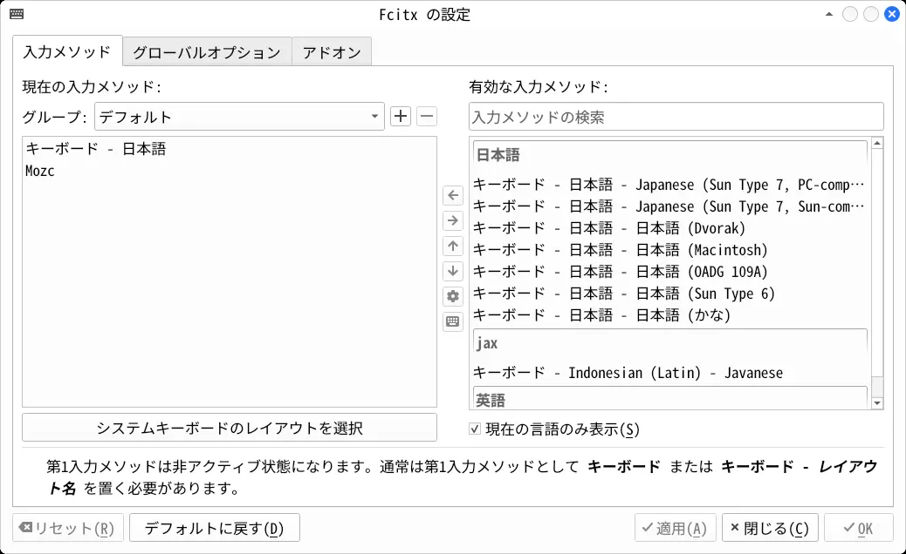
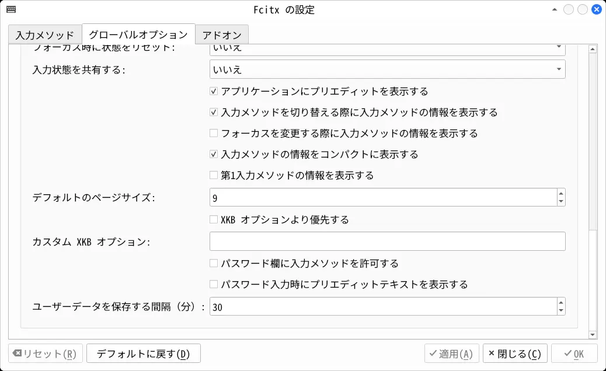
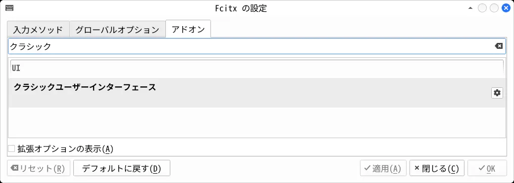
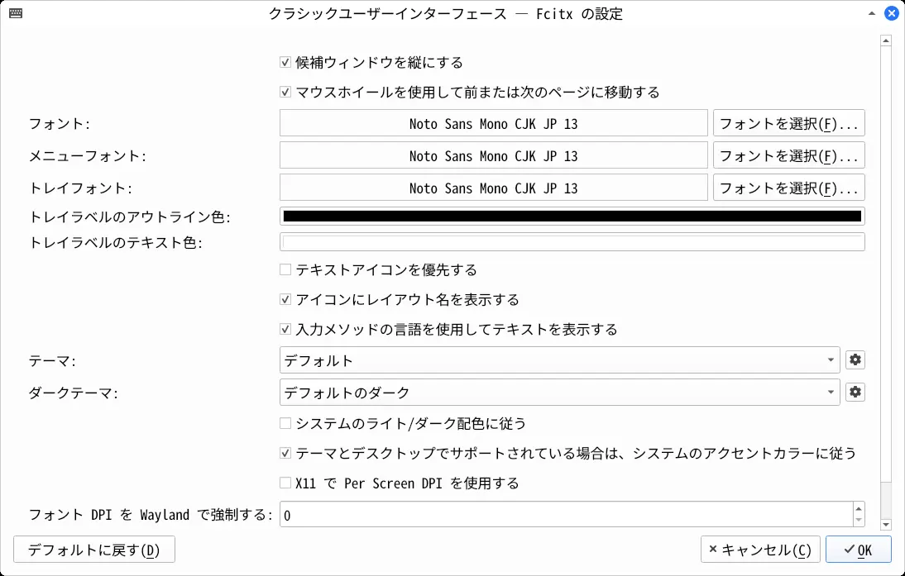
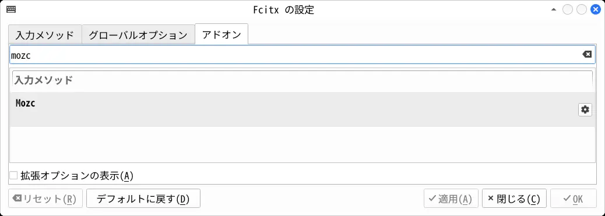
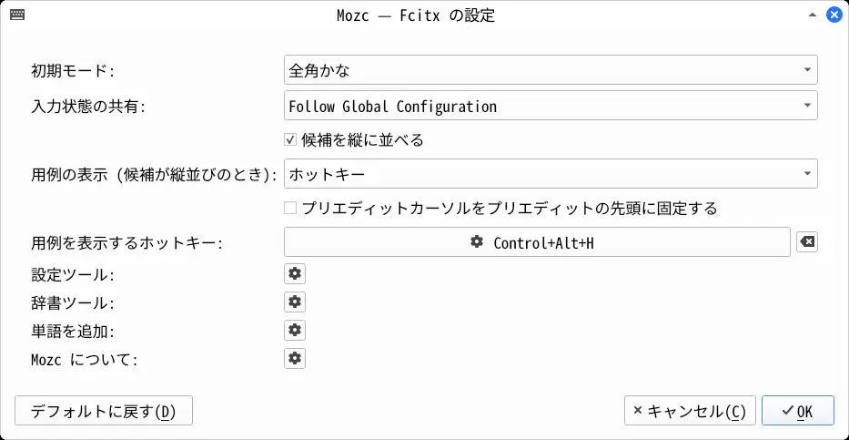

## 最初に行うこと

```
sudo pacman -S --needed wget
mkdir -p ~/tmp_arch
cd ~/tmp_arch/

# [CachyOS] デフォルトシェルを bash に変更
chsh -s /usr/bin/bash

# [CachyOS] 起動時のロゴ表示を無効にする
cp /etc/sdboot-manage.conf .
sed -i -e 's,LINUX_OPTIONS=\".*splash\",LINUX_OPTIONS=\"\",g' sdboot-manage.conf
sudo mv sdboot-manage.conf /etc/
sudo sdboot-manage gen

# [archinstall] ログを削除
sudo rm -rf /var/log/archinstall/

# 高速なダウンロードサーバを選択
sudo pacman -S --needed archlinux-keyring
sudo pacman -S --needed reflector rsync
sudo reflector -c jp -f 5 --save /etc/pacman.d/mirrorlist
sudo pacman -Sy

# [CachyOS] 高速なダウンロードサーバを選択
sudo cachyos-rate-mirrors

# AUR パッケージをビルドするときのスレッド数を論理プロセッサ数にする
cp /etc/makepkg.conf .
sed -i -e 's,#MAKEFLAGS="-j2",MAKEFLAGS="-j\$(nproc)",g' makepkg.conf
sudo mv makepkg.conf /etc/

# debug パッケージを作らない
cp /etc/makepkg.conf .
sed -i -e 's,purge\ debug,purge\ \!debug,g' makepkg.conf
sudo mv makepkg.conf /etc/

# multilib を使用しない
cp /etc/pacman.conf .
python -c "import sys; open('pacman.conf.new', 'w').write(open('pacman.conf').read().replace('[multilib]\n\nInclude', '#[multilib]\n\n#Include'))"
sudo mv pacman.conf.new /etc/pacman.conf

# [CachyOS, EndeavourOS] yay をインストール
sudo pacman -S --needed yay

# [Arch Linux] yay をインストール
# wget -N https://aur.archlinux.org/cgit/aur.git/snapshot/yay-bin.tar.gz
# tar -xf yay-bin.tar.gz
# cd yay-bin/
# makepkg -is
# cd ~/tmp_arch/

# パッケージのキャッシュを削除
yay -Scc

# パッケージのキャッシュディレクトリを /tmp に変更（再起動するとキャッシュが空になる）
cp /etc/pacman.conf .
sed -i -e 's,#CacheDir\ \ \ \ \=\ \/var,CacheDir\ \ \ \ \ \=\ \/tmp,g' pacman.conf
sudo mv pacman.conf /etc/

# DNSリゾルバを Cloudflare に変更
printf "[main]
dns=none" > NetworkManager.conf
sudo mv NetworkManager.conf /etc/NetworkManager/

printf "nameserver 2606:4700:4700::1111
nameserver 2606:4700:4700::1001" > resolv.conf
sudo mv resolv.conf /etc/

# DNSリゾルバを Google Public DNS に変更する場合
# printf "nameserver 2001:4860:4860::8888
# nameserver 2001:4860:4860::8844" > resolv.conf
# sudo mv resolv.conf /etc/

# NetworkManager を再起動してDNSサーバを確認
sudo systemctl restart NetworkManager
yay -S --needed bind
dig https://www.youtube.com | grep SERVER
# ;; SERVER: 2606:4700:4700::1111

# 時刻サーバを日本のものに変更
yay -S --needed ntp

printf 'server 0.jp.pool.ntp.org iburst
server 1.jp.pool.ntp.org iburst
server 2.jp.pool.ntp.org iburst
server 3.jp.pool.ntp.org iburst
' > ntp.conf

sudo mv ntp.conf /etc/ntp.conf
sudo systemctl enable ntpd

# ntpd の動作確認
sudo systemctl start ntpd
systemctl status ntpd | grep Active
# Active: active (running)

# 「デスクトップ」などのディレクトリが作られるのを止める
printf 'XDG_DESKTOP_DIR="$HOME"
XDG_DOWNLOAD_DIR="$HOME"
XDG_TEMPLATES_DIR="$HOME"
XDG_PUBLICSHARE_DIR="$HOME"
XDG_DOCUMENTS_DIR="$HOME"
XDG_MUSIC_DIR="$HOME"
XDG_PICTURES_DIR="$HOME"
XDG_VIDEOS_DIR="$HOME"
' > ~/.config/user-dirs.dirs

# コアダンプを無効にする
printf "kernel.core_pattern=|/bin/false" > 50-coredump.conf
sudo mv 50-coredump.conf /etc/sysctl.d/50-coredump.conf
sudo sysctl -p /etc/sysctl.d/50-coredump.conf

# 既存のダンプファイルを削除
sudo rm /var/lib/systemd/coredump/*

# noto-fonts-cjk をインストール
yay -S --needed noto-fonts-cjk

# ホームディレクトリに NotoSansCJK-Regular.ttc をインストール
# システムに日本語フォントが存在しない場合でも、
# 管理者権限で実行するアプリ以外なら日本語を表示できるようになる
mkdir -p ~/.local/share/fonts/
cp -f /usr/share/fonts/noto-cjk/NotoSansCJK-Regular.ttc ~/.local/share/fonts/

# ディスプレイマネージャのフォントを noto-fonts-cjk に変更
cp /etc/fonts/conf.d/65-nonlatin.conf .
sed -i -e 's,Artsounk,Noto\ Serif\ CJK\ JP,g' 65-nonlatin.conf
sed -i -e 's,Nachlieli,Noto\ Sans\ CJK\ JP,g' 65-nonlatin.conf
sed -i -e 's,Miriam\ Mono,Noto\ Sans\ Mono\ CJK\ JP,g' 65-nonlatin.conf
sudo mv 65-nonlatin.conf /etc/fonts/conf.d/

# AMD の GPU を使用する場合: ドライバをインストール
yay -S --needed xf86-video-amdgpu vulkan-radeon libva-utils
```

## 日本語を入力できるようにする

### Fcitx5 と Mozc をインストール

```
yay -S --needed fcitx5 fcitx5-configtool fcitx5-gtk fcitx5-qt fcitx5-mozc-ut

# Fcitx5 をデフォルトの入力メソッドフレームワークにする
printf 'export GTK_IM_MODULE=fcitx
export QT_IM_MODULE=fcitx
export XMODIFIERS=@im=fcitx
' > ~/.xprofile
```

設定を有効にするためログアウトしてログイン。

### Fcitx5 を設定

```
fcitx5-configtool 
```


左側の「現在の入力メソッド」に Mozc があるのを確認する。
ない場合は右側の「有効な入力メソッド」から追加して、「適用」を押す。


「グローバルオプション」タブを開き、一番下までスクロール。
「第1入力メソッドの情報を表示する」のチェックを外して、「適用」を押す。


「アドオン」タブを開き、検索欄に「クラシック」と入力。
ヒットした「クラシックユーザーインタフェース」の「設定」を押す。


フォントを変更。


「アドオン」タブを開き、検索欄に「mozc」と入力。
ヒットした「Mozc」の「設定」を押す。


「用例を表示」を「ホットキー」にする。
「プリエディットカーソルをプリエディットの先頭に固定する」のチェックを外す。

### Mozc の変換精度が下がってきた場合

```
/usr/lib/mozc/mozc_tool --mode=config_dialog
```

「辞書」タブを開き、「学習履歴のクリア」をクリック。

[HOME](index.html)
