## Calam-Arch-Installer とは

Calam-Arch-Installer は、Arch Linux を Calamares でインストールするためのディストリビューション。パッケージのすべてが Arch 純正なので、派生系特有の不具合が生じにくい。

## ダウンロード

[こちら](https://sourceforge.net/projects/blue-arch-installer/files/arch-installer/)。

## Ventoy をUSBメモリにインストール

[Ventoy](https://github.com/ventoy/Ventoy/releases) はブータブルUSBドライブを作成するツール。Ventoy のインストール後にOSのISOファイルをUSBメモリにコピーすると、そのOSを起動できるようになる。複数のISOファイルをコピーして、起動するOSを選択することもできる。

ventoy-*-linux.tar.gz をダウンロードして展開。

USBメモリを差し込んで Ventoy のインストーラーを起動。

```
./VentoyGUI.x86_64
```

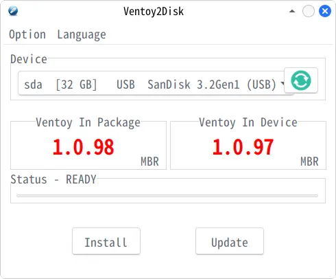

インストール先を必ず確認。
新規の場合は「Install」を選択。USBメモリ内のファイルはすべて消える。
アップデートの場合は「Update」を選択。USBメモリ内のファイルは維持される。

## Calam-Arch-Installer のISOファイルをUSBメモリにコピー

Calam-Arch-Installer のISOファイルをUSBメモリにコピーする。
[Kubuntu](https://kubuntu.org/getkubuntu/) などの利用者が多いOSのISOファイルもコピーしておく。Calam-Arch-Installer のインストールが失敗したとき、別のOSのISOファイルがないと何もできなくなる。

## Calam-Arch-Installer をシステムにインストール

USBメモリを挿してPCの電源を入れる。

BIOS画面でブートメニューキーを押し続ける。ブートメニューキーは次のとおり。

メーカー | ブートメニューキー
-- | --
ASUS | F8
ASRock | F11
GIGABYTE | F12
MSI | F11

ブートメニューキーを押すとブートデバイスの選択画面が出る。
あらかじめUEFIで「CSM Support」を無効にしておくと、UEFIブートに対応していないデバイスが非表示になるので、選択が楽になる。


Ventoy のメニューでISOファイルを選択。

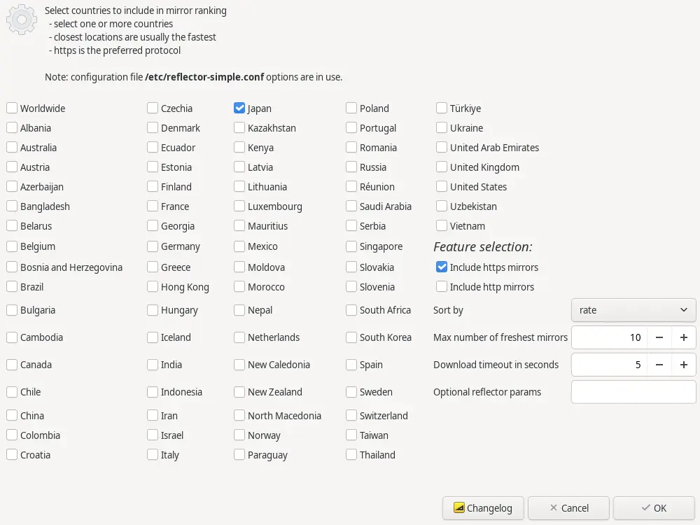
ミラーサーバーの地域を選択。「Japan」にチェックが入っているのを確認する。

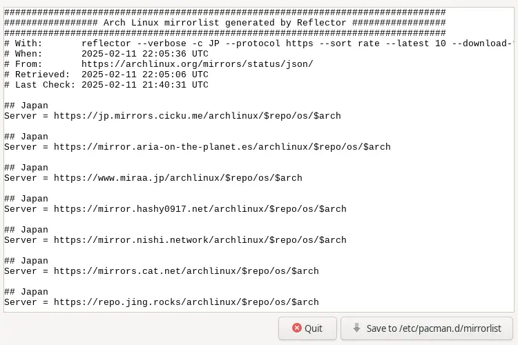
「Save」を押す。

ターミナルを起動して日本語フォントをインストール。

```
sudo pacman -Sy
sudo pacman -S --needed otf-ipafont
```

Calamares を起動。

```
sudo calamares
```

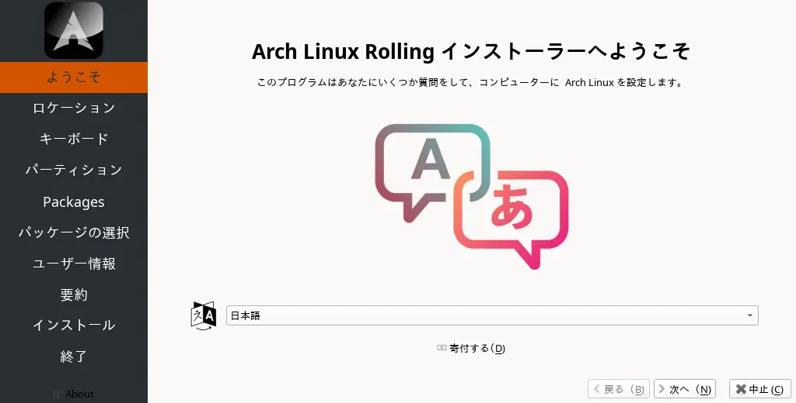
「次へ」を押せるようになるまで待つ。1分以上かかることがある。

文字が小さくて読みづらい場合は次を実行。

```
xfce4-display-settings 
```

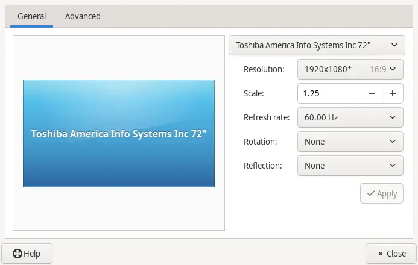
Scale を 1.25 にして「Apply」を押す。

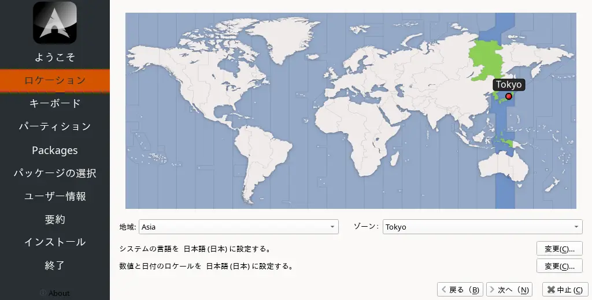
「Tokyo」が選択されているのを確認。

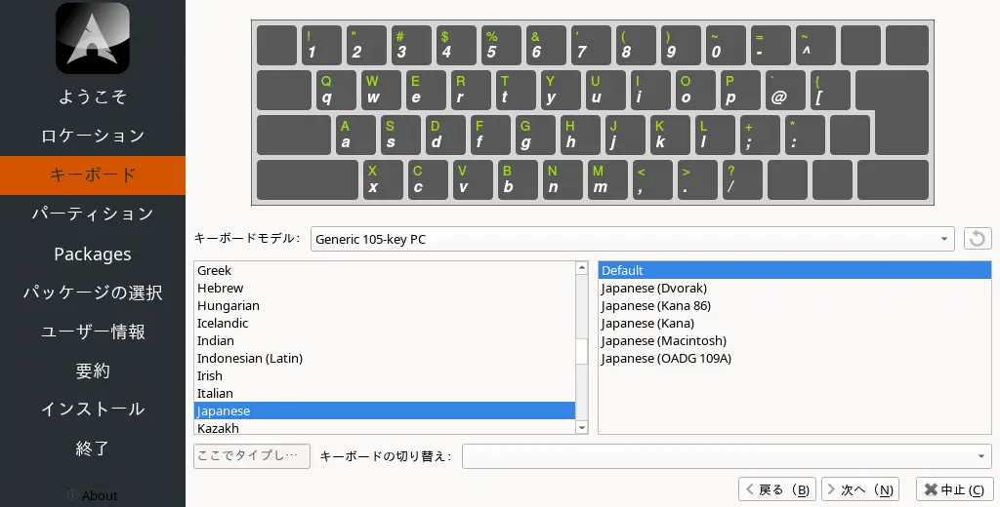
キーボードモデルを選択。

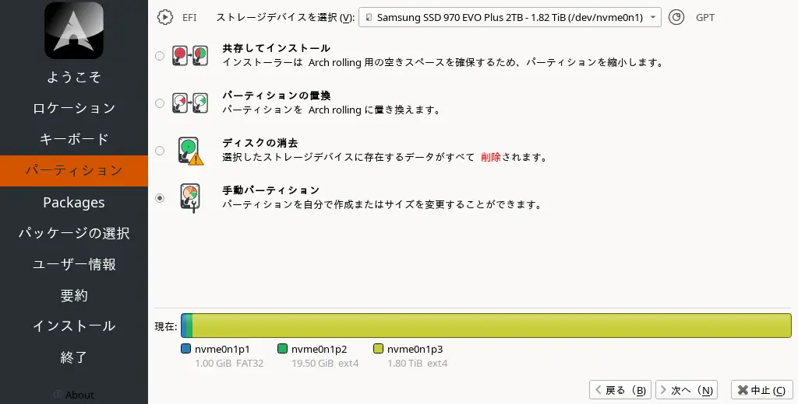
「手動パーティション」を選択。

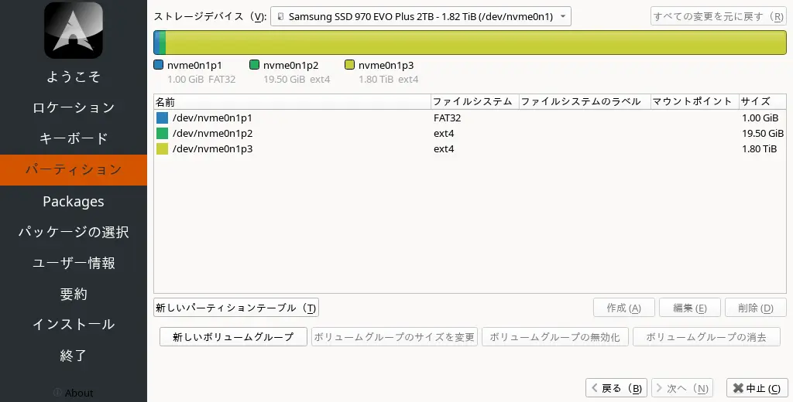
パーティションを作成。
私は次のようにしています。余裕をもたせるなら「/」は 30000 MiB にする。

| パーティション | サイズ    | 内容         | ファイルシステム | フラグ    |
| -------------- | --------- | ------------ | ---------------- | --------- |
| /boot/efi      | 2048 MiB   | フォーマット | fat32            | boot      |
| /              | 20000 MiB | フォーマット | ext4             | なし      |
| /home          | 残り全部  | 保持         | ext4             | なし      |

「/home」は初めて作成する場合のみフォーマット。

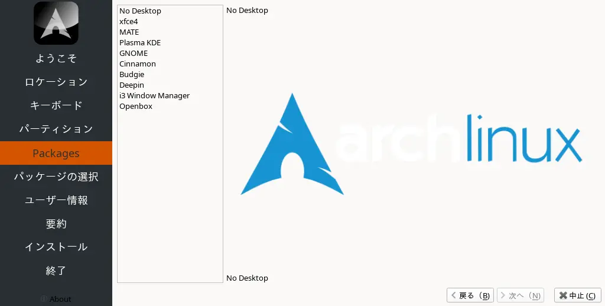
デスクトップを選択。

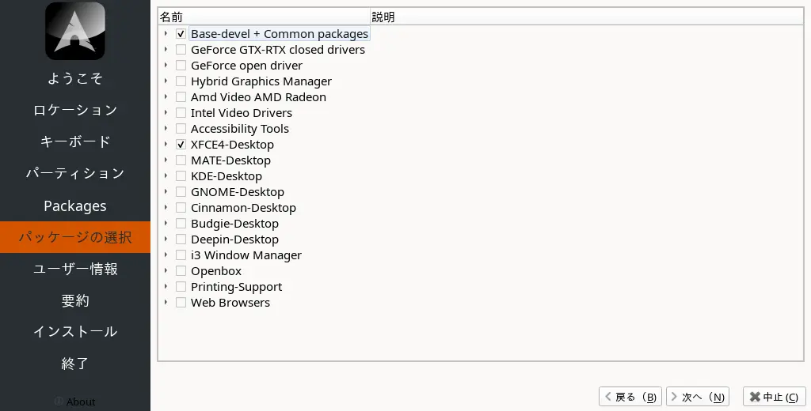
インストールするパッケージを選択。

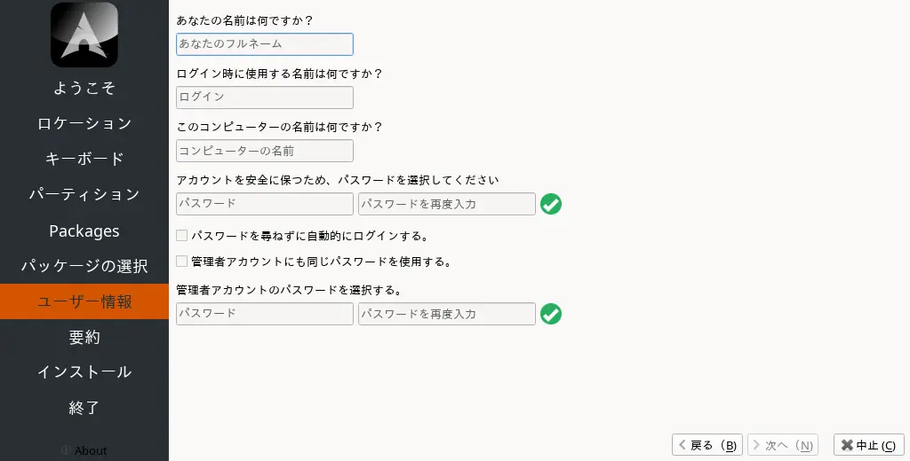
ユーザー名とパスワードを設定。

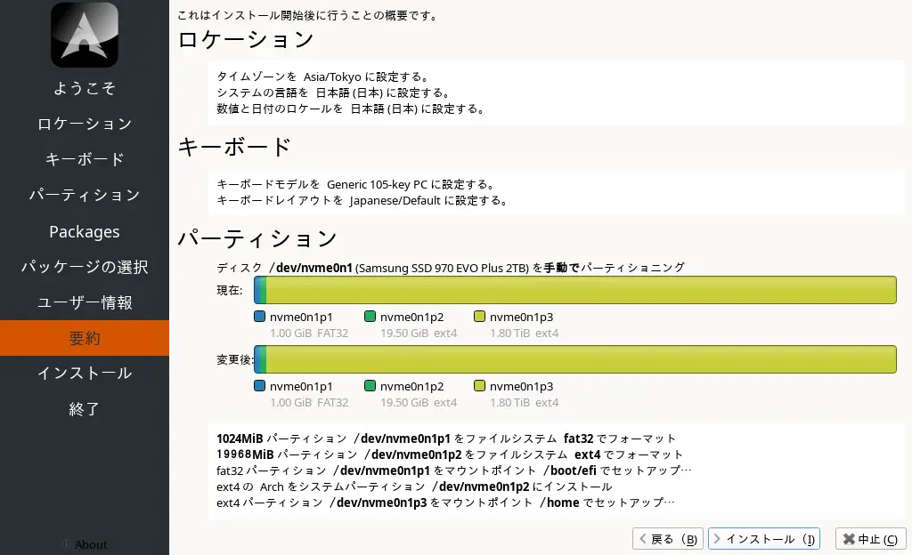
内容を確認して「インストール」をクリック。

インストールが終わったら再起動して[設定を行う](arch_linux_01.html)。

[HOME](index.html)
