## EndeavourOS とは

EndeavourOS は Arch Linux をベースにしたディストリビューション。
Calamares で簡単にインストールできる。
日本語フォントが入っているので文字化けしない。
オンラインインストールを選択できるので、最新の環境をすぐに使える。
CachyOS と比べて[独自パッケージが少なく](https://github.com/endeavouros-team/repo/tree/master/endeavouros/x86_64)、純正の Arch Linux に近い。

## ダウンロード

[こちら](https://endeavouros.com/)。

## Ventoy をUSBメモリにインストール

[こちら](https://github.com/ventoy/Ventoy/releases)から Ventoy をダウンロード。

USBメモリを差し込んでデバイスのパスを確認。

```
lsblk -p | grep disk

# /dev/sda           8:0    1 28.7G  0 disk 
# /dev/zram0       253:0    0    4G  0 disk [SWAP]
# /dev/nvme0n1     259:0    0  1.8T  0 disk 
```

ディスクのサイズから /dev/sda がUSBデバイスのパスだと判断。

Ventoy を /dev/sda にインストール。
Wayland ではGUI版を起動できないのでCUI版を使用する。
以下のコマンドでは無確認でフォーマットすることがないよう、パスを /dev/sdX にしている。

新規の場合（USBメモリがフォーマットされる）:

```
sudo sh Ventoy2Disk.sh -i /dev/sdX
```

アップデートの場合:

```
sudo sh Ventoy2Disk.sh -u /dev/sdX
```

## EndeavourOS のISOファイルをUSBメモリにコピー

EndeavourOS のISOファイルをUSBメモリにコピーする。
[Kubuntu](https://kubuntu.org/download/) などの利用者が多いOSのISOファイルもコピーする。インストールが失敗したとき、別のOSがないと何もできなくなる。

## EndeavourOS をシステムにインストール

USBメモリを挿してPCの電源を入れ、ブートメニューキーを押す。
ブートメニューキーは次のとおり。

メーカー | ブートメニューキー
-- | --
ASUS | F8
ASRock | F11
GIGABYTE | F12
MSI | F11

ブートメニューキーを押すとブートデバイスの選択画面が出る。
あらかじめUEFIで「CSM Support」を無効にしておくと、UEFIブートに対応していないデバイスが非表示になるので、選択が楽になる。


Ventoy のメニューでISOファイルを選択。
しばらく待つとデスクトップが起動する。

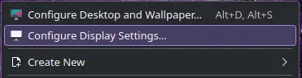
文字が小さいときは壁紙を右クリックして「Configure Display Settings...」を選択。

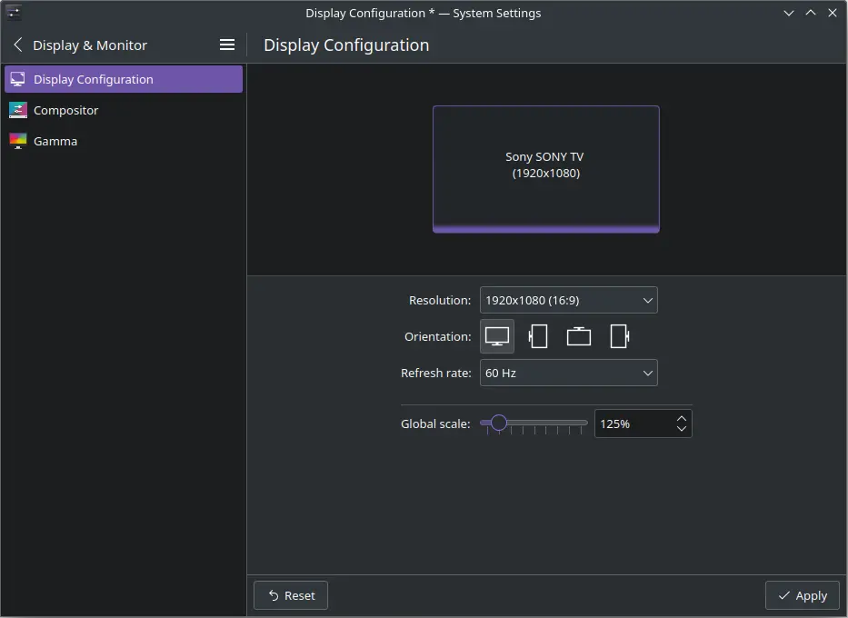
「Global scale」のスライダーを右に動かして「125%」にする。

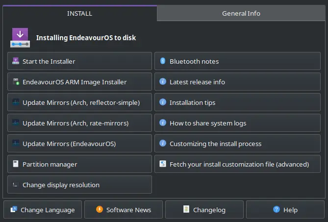
左上の「Start the installer」をクリック。

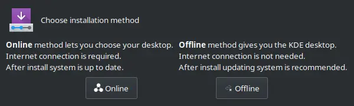
インストール方法は「Online」を選択。最新のパッケージをネットからダウンロードしてインストールする。「Offline」を選択するとKDEデスクトップしか選べないし、インストール後のシステムアップデートが膨大になる。

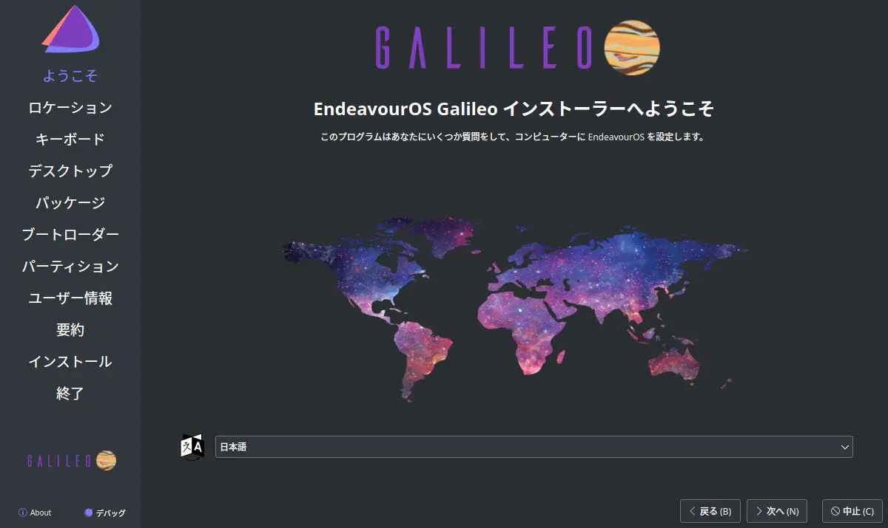
「日本語」が選択されているのを確認して「次へ」をクリック。

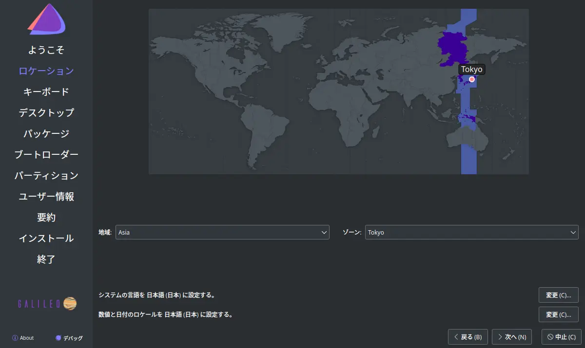
「Tokyo」が選択されているのを確認。

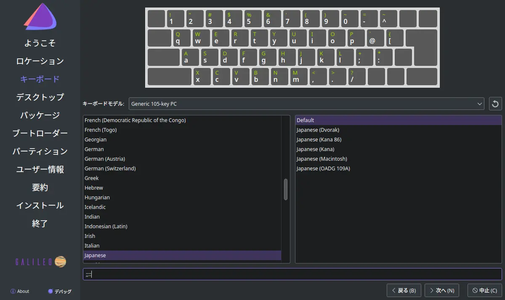
キーボードモデルを選択。

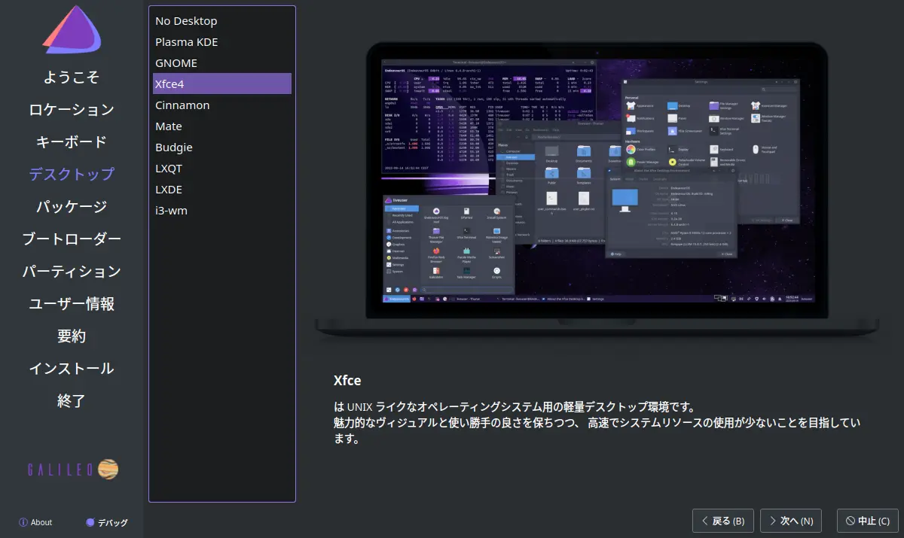
デスクトップを選択。

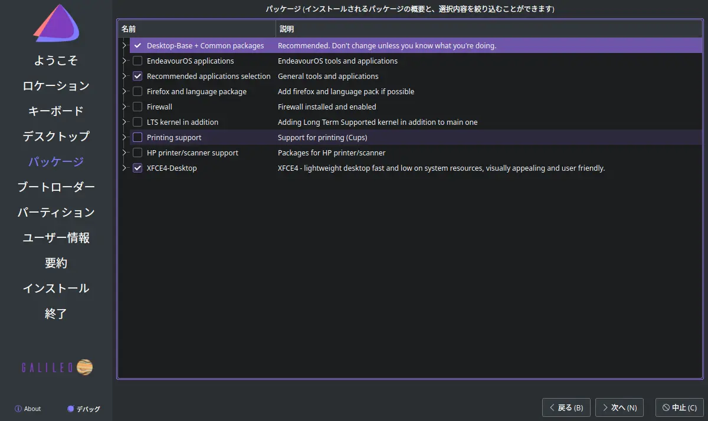
インストールするパッケージを選択。

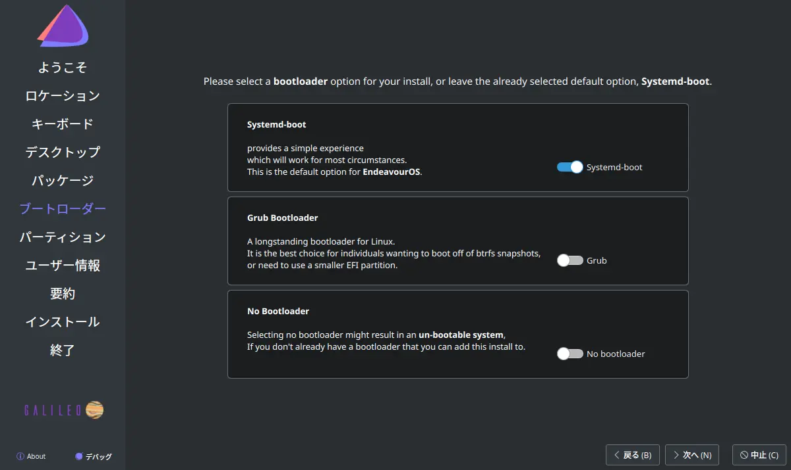
ブートローダーを選択。デフォルトは systemd-boot 。

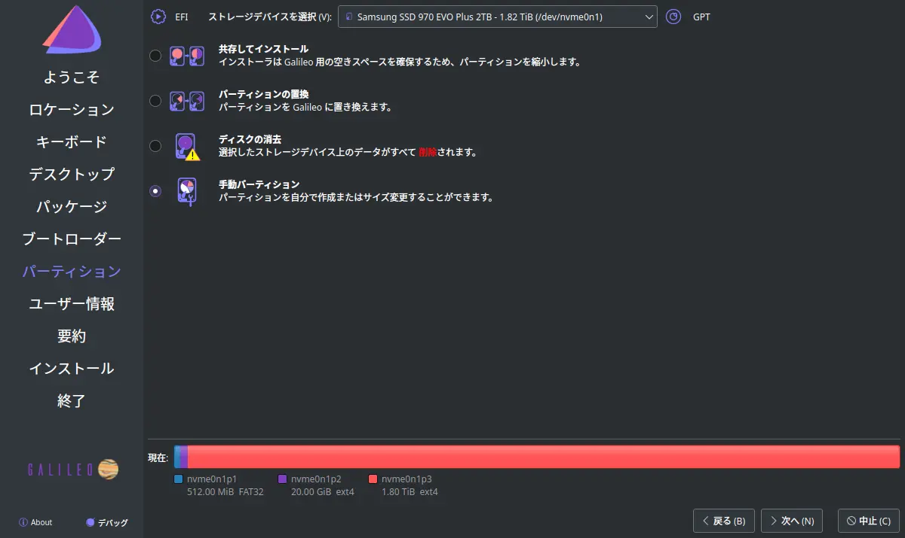
「手動パーティション」を選択。

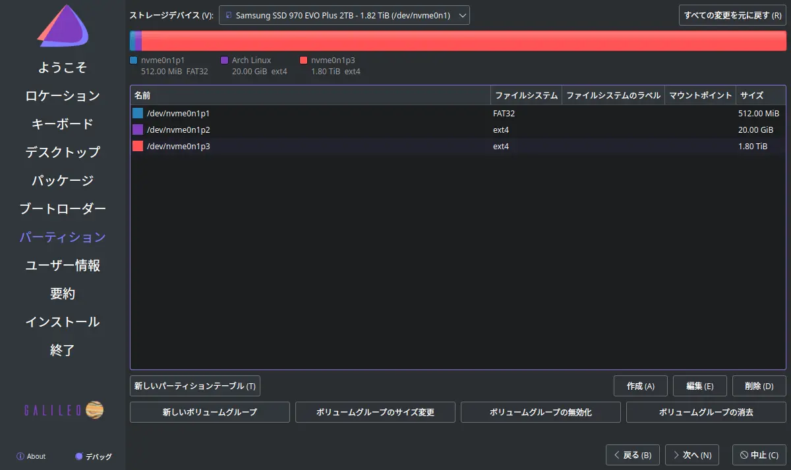
パーティションを作成。

| パーティション  | サイズ    | フォーマット | ファイルシステム | フラグ    |
| -------------- | --------- | ------------ | ---------------- | --------- |
| /efi           | 2048 MiB  | する         | fat32            | boot      |
| /              | 30720 MiB | する         | ext4             | なし      |
| /home          | 残り全部  | しない       | ext4             | なし      |

「/home」は初めて作成する場合のみフォーマット。

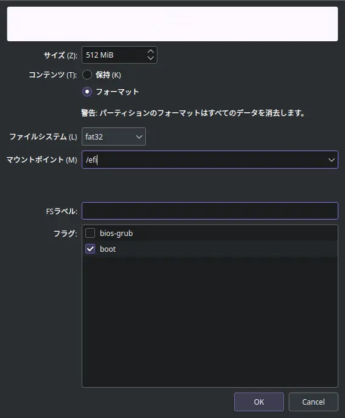
/efi パーティションの編集例。

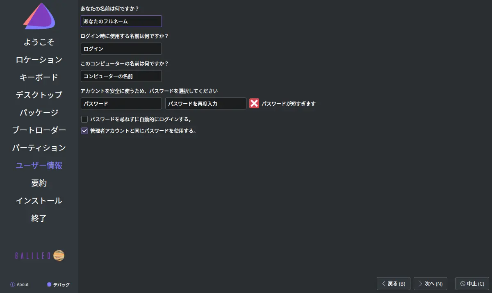
ユーザー名とパスワードを設定。

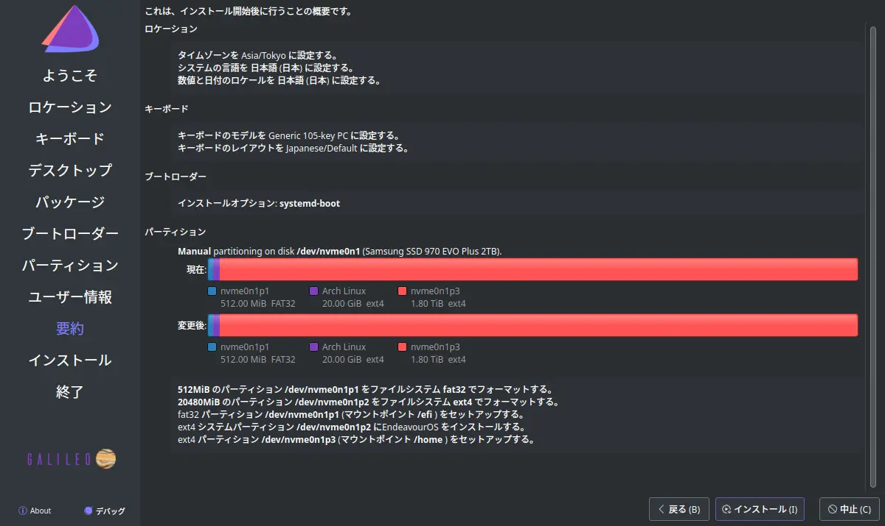
内容を確認して「インストール」をクリック。

インストールが終わったら再起動して[設定を行う](arch_linux_01.html)。

[HOME](index.html)
