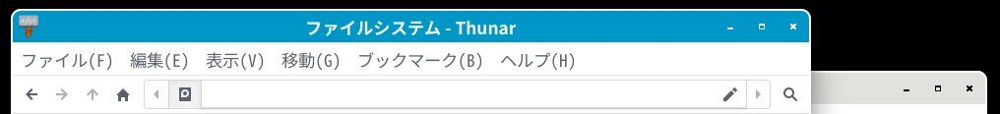

## LXQt をインストール

```
yay -S lxqt lxqt-wayland-session labwc
```

## Labwc を設定

### キーボードレイアウトを「jp」に変更

```
mousepad ~/.config/labwc/environment
```

「# XKB_DEFAULT_LAYOUT=se」を
「XKB_DEFAULT_LAYOUT=jp」に変更。

設定を反映させる。

```
labwc --reconfigure
```

### マウスカーソルのテーマを変更

```
mousepad ~/.config/labwc/environment
```

「# XCURSOR_THEME=」を
「XCURSOR_THEME=Future-cursors」に変更。
「# XCURSOR_SIZE=」を
「XCURSOR_SIZE=24」に変更。

### マウスホイールでウィンドウを上に出す

```
mousepad ~/.config/labwc/rc.xml
```

「\<context name=\"TitleBar\"\>」の部分を次のように変更。

```
      <mousebind direction="Up" action="Scroll">
        <action name="Focus" />
        <action name="Raise" />
      </mousebind>
      <mousebind direction="Down" action="Scroll">
        <action name="Focus" />
        <action name="Raise" />
      </mousebind>
```

「\<context name=\"Client\"\>」の部分に次の行を追加。

```
      <mousebind direction="Up" action="Scroll">
        <action name="Focus" />
        <action name="Raise" />
      </mousebind>
      <mousebind direction="Down" action="Scroll">
        <action name="Focus" />
        <action name="Raise" />
      </mousebind>
```

### 中クリックでのテキスト貼り付けを有効にする

```
gsettings set org.gnome.desktop.interface gtk-enable-primary-paste true
```

### 音量変更のショートカットを設定

「lxqt-config-globalkeyshortcuts」は Wayland ではサポートされていない。

```
mousepad ~/.config/labwc/rc.xml
```

「Ctrl+PageUp」「Ctrl+PageDown」で音量を変更する場合は次のように設定。

```
    <keybind key="C-Next">
      <action name="Execute" command="lxqt-qdbus volume down" />
    </keybind>
    <keybind key="C-Prior">
      <action name="Execute" command="lxqt-qdbus volume up" />
    </keybind>
```

### QTerminal のドロップダウンを無効にする

```
mousepad ~/.config/labwc/rc.xml
```

この部分を削除。

```
    <!-- For qterminal dropdown -->
    <keybind key="F12">
      <action name="Execute" command="qterminal -d" />
    </keybind>
```

### 壁紙を左クリックしたときにメニューを表示しない

```
mousepad ~/.config/labwc/rc.xml
```

この部分を削除。

```
      <mousebind button="Left" action="Press">
        <action name="ShowMenu" menu="root-menu" />
      </mousebind>
```

### 壁紙を右クリックしたときに表示されるメニューを更新

```
yay -S labwc-menu-generator-git
labwc-menu-generator --icons > ~/.config/labwc/menu.xml
labwc --reconfigure
```

### Labwc のテーマを変更

私は自分で作成した青系のテーマを使用しています。


ファイルは[こちら](images/labwc/Labwc-Blue/themerc)。
ダウンロードしたファイルをインストール。

```
mkdir -p ~/.local/share/themes/Labwc-Blue/labwc
mv themerc ~/.local/share/themes/Labwc-Blue/labwc/
```

rc.xml を編集。

```
mousepad ~/.config/labwc/rc.xml
```

\<theme\> を次のように変更。

```
  <theme>
    <name>Labwc-Blue</name>
```

GUI で設定する場合は「labwc-tweaks」を使用する。

#### 自分でテーマを作成する場合

```
mkdir -p ~/.local/share/themes/theme_name/labwc
cp /usr/share/doc/labwc/themerc ~/.local/share/themes/theme_name/labwc/
```

ローカルの themerc を編集して適用。

## その他の設定

### 「Noto Sans Mono CJK JP」を等幅フォントとして認識させる

LXQt では「Noto Sans Mono CJK JP」が等幅フォントとして[認識されない](https://github.com/notofonts/noto-fonts/issues/2393)。

```
mkdir -p ~/.config/fontconfig/conf.d
mousepad ~/.config/fontconfig/conf.d/70-noto-mono.conf
```

次の内容を貼り付けて保存。

```
<?xml version="1.0"?>
<!DOCTYPE fontconfig SYSTEM "fonts.dtd">
<fontconfig>
    <match target="scan">
        <test name="family">
            <string>Noto Sans Mono CJK JP</string>
        </test>
        <edit name="spacing" mode="assign">
            <int>100</int>
        </edit>
    </match>
</fontconfig>
```

フォント情報のキャッシュを更新。

```
fc-cache -f -v
```

次のコマンドでフォントファイルが表示されるのを確認。

```
fc-list :spacing=100 | grep -i "Noto Sans Mono CJK JP:style=Regular"
```

### 時計の表示形式を設定

「形式を詳しく指定する」にチェックを入れて、
「MM月dd日 (ddd) HH:mm」と指定する。

### パネルの設定

幅: 38 ピクセル
アイコン: 32 ピクセル
場所: 画面上部

### LXQt セッションの設定

「セッション終了時に確認する」のチェックを外す。
「サスペンド/ハイバネートの前に画面をロックする」のチェックを外す。

### ファンシーメニューの設定

「カテゴリの位置」を「左」にする。

### パネルに CPU の温度と使用率を表示

[get_cpu_usage_and_temp.py](images/labwc/get_cpu_usage_and_temp.py) をダウンロード。
「ウィジェットの管理」で「カスタムコマンド」を追加。
「カスタムコマンドの設定」をクリックして次のコマンドを書く。

```
python ~/get_cpu_usage_and_temp.py
```

[HOME](index.html)
