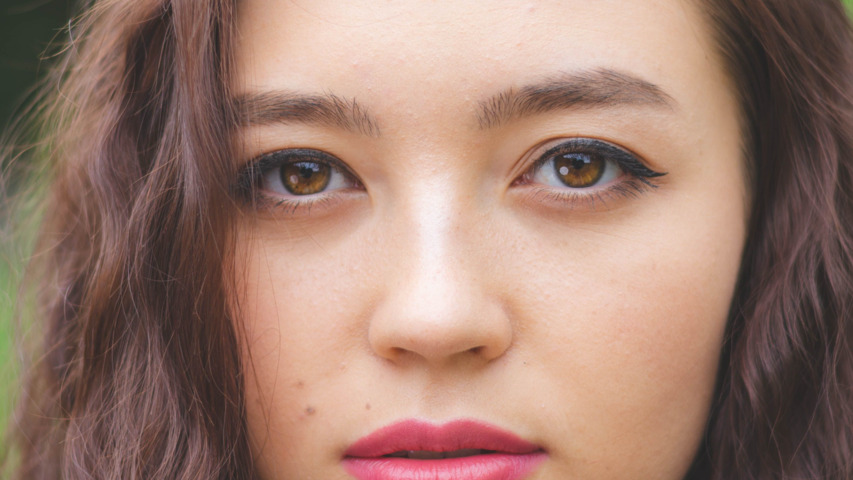

## mpv の特徴

[mpv](https://mpv.io/) はフリーのメディアプレーヤーで、次の特徴がある。

- 高品質なビデオ出力（OpenGL, Vulkan）
- ビデオのハードウェアデコード
- オンスクリーンコントローラー（マウスを動かすと表示される）
- 活発に[開発中](https://github.com/mpv-player/mpv/commits/master)

## 基本設定

### mpv.conf を設定

~/.config/mpv/mpv.conf に次の行を追加。

```
# ビデオ出力ドライバー
# https://mpv.io/manual/stable/#video-output-drivers
vo=gpu-next

# グラフィックスAPI
# https://mpv.io/manual/stable/#options-gpu-api
gpu-api=auto

# ハードウェアビデオデコードを有効にする
# https://mpv.io/manual/stable/#options-hwdec
hwdec=auto

# ハードウェアデコードを行うコーデック
# 「vainfo | grep AV1」を実行して、何も表示されない場合は「av1,」を削除。
# https://mpv.io/manual/stable/#options-hwdec-codecs
hwdec-codecs=h264,vc1,hevc,vp8,vp9,prores,prores_raw,ffv1,dpx
```

```
# アップスケーラー
# https://mpv.io/manual/stable/#options-scale
scale=lanczos

# ダウンスケーラー
# https://mpv.io/manual/stable/#options-dscale
dscale=lanczos
```

```
# オーディオ出力ドライバー
# https://mpv.io/manual/stable/#audio-output-drivers-ao
ao=pipewire
```

```
# 音声のみのファイルでもウィンドウを表示
# https://mpv.io/manual/stable/#options-force-window
force-window=yes

# ウィンドウを最大化
# https://mpv.io/manual/stable/#options-window-maximized
window-maximized=yes

# ターミナル出力の冗長性を減らす
# https://mpv.io/manual/stable/#options-quiet
quiet=yes

# ウィンドウ右下の「残り時間」を「全体時間」に変更
# https://mpv.io/manual/stable/#on-screen-controller-timetotal
script-opts=osc-timetotal=yes

# ウィンドウのタイトルバーに動画タイトルではなくファイル名を表示
# https://mpv.io/manual/stable/#options-title
title=${filename}

# プレイリストに動画タイトルではなくファイル名を表示
# https://mpv.io/manual/stable/#options-osd-playlist-entry
osd-playlist-entry=filename
```

### input.conf を設定

~/.config/mpv/input.conf に次の行を追加。デフォルトは[こちら](https://github.com/mpv-player/mpv/blob/master/etc/input.conf)。

```
# 右クリックで一時停止しない
MBTN_RIGHT ignore

# マウスホイールで音量を変更しない
WHEEL_UP ignore
WHEEL_DOWN ignore

# チルトホイールで10秒移動しない
WHEEL_LEFT ignore
WHEEL_RIGHT ignore

# PGUP と PGDWN で10分移動
PGUP seek 600
PGDWN seek -600
```

```
# マウスの進むボタンと戻るボタンで次/前のファイルに移動
MBTN_FORWARD playlist-next;show-text ${playlist} 2000
MBTN_BACK playlist-prev;show-text ${playlist} 2000

# . と , で次/前のファイルに移動
. playlist-next;show-text ${playlist} 2000
, playlist-prev;show-text ${playlist} 2000

# \ と / で次/前のチャプターに移動
\ add chapter 1
/ add chapter -1
```

```
# i でファイル情報の表示をトグル
# I でファイル情報を一時的に表示
i script-binding stats/display-stats-toggle
I script-binding stats/display-stats

# Ctrl+d で再生中のファイルをゴミ箱に移動
Ctrl+d run gio trash "${path}"; playlist-remove current; show-text "\"${filename}\" をゴミ箱に移動しました" 5000

# Esc で終了
ESC quit
```

### モニターに超解像技術が搭載されている場合

モニターに超解像技術が搭載されている場合はオフにする。アップスケーラーの効果がわかりづらくなるので。
REGZA を使用している場合は次のようにする。

- 低遅延モード: オン (オフだと黒背景時の赤文字が滲む)
- レゾリューションプラス: オフ
- ヒストグラムバックライト制御: オン
- 質感リアライザー: オート (オフだと全体が白っぽくなる)

## アップスケーラーをインストール

負荷が軽めのものを選んだ。

### RAVU

Google の超解像技術から着想を得たアップスケーラー。
[https://github.com/bjin/mpv-prescalers](https://github.com/bjin/mpv-prescalers)
ファイル名に「-ar」が付くものは、anti-ringing（リンギングを減らす。リンギング: 輪郭まわりの[リング状のゴースト](https://en.wikipedia.org/wiki/Ringing_artifacts)）処理が行われる。RAVU の作者が使用を[推奨](https://github.com/bjin/mpv-prescalers#about-ravu)している。

```
wget https://raw.githubusercontent.com/bjin/mpv-prescalers/refs/heads/master/compute/ravu-lite-ar-r3.hook
mkdir -p ~/.config/mpv/shaders
mv ravu-lite-ar-r3.hook ~/.config/mpv/shaders/
```

[compute](https://github.com/bjin/mpv-prescalers/tree/master/compute) ディレクトリのものが高速。動作しない場合は [gather](https://github.com/bjin/mpv-prescalers/tree/master/gather) か[ルート](https://github.com/bjin/mpv-prescalers/tree/master)のものを使用する。

### Anime4K

1080pアニメのアップスケールに最適化されたアップスケーラー。
720p以下のアニメには最適化されていない。
[https://github.com/bloc97/Anime4K](https://github.com/bloc97/Anime4K)
ここでは「Anime4K_Upscale_Denoise_CNN_x2_M.glsl」を使用する。

```
wget https://raw.githubusercontent.com/bloc97/Anime4K/refs/heads/master/glsl/Upscale%2BDenoise/Anime4K_Upscale_Denoise_CNN_x2_M.glsl
mv Anime4K_Upscale_Denoise_CNN_x2_M.glsl ~/.config/mpv/shaders/
```

### FSRCNNX

FSRCNN（高速超解像畳み込みニューラルネットワーク）を使用したアップスケーラー。
[https://github.com/igv/FSRCNN-TensorFlow](https://github.com/igv/FSRCNN-TensorFlow)

```
wget https://github.com/igv/FSRCNN-TensorFlow/releases/download/1.1/FSRCNNX_x2_8-0-4-1.glsl
mv FSRCNNX_x2_8-0-4-1.glsl ~/.config/mpv/shaders/
```

### ArtCNN

アニメコンテンツを対象としたアップスケーラー。
[https://github.com/Artoriuz/ArtCNN](https://github.com/Artoriuz/ArtCNN)
ファイル名に「_DS」が付いているものは、denoise（ノイズ除去）と sharpen（シャープ化）を行う。

```
wget https://raw.githubusercontent.com/Artoriuz/ArtCNN/refs/heads/main/GLSL/ArtCNN_C4F16.glsl
wget https://raw.githubusercontent.com/Artoriuz/ArtCNN/refs/heads/main/GLSL/ArtCNN_C4F16_DS.glsl
mv ArtCNN_C4F*.glsl ~/.config/mpv/shaders/
```

### アップスケーラーにショートカットを割り当てる

~/.config/mpv/input.conf に次の行を追加。

```
# アップスケーラーの切り替え
Ctrl+1 change-list glsl-shaders set "~~/shaders/ravu-lite-ar-r3.hook"
Ctrl+2 change-list glsl-shaders set "~~/shaders/Anime4K_Upscale_Denoise_CNN_x2_M.glsl"
Ctrl+3 change-list glsl-shaders set "~~/shaders/FSRCNNX_x2_8-0-4-1.glsl"
Ctrl+4 change-list glsl-shaders set "~~/shaders/ArtCNN_C4F16_DS.glsl"
Ctrl+5 change-list glsl-shaders set "~~/shaders/ArtCNN_C4F16.glsl"
Ctrl+0 change-list glsl-shaders set ""; set scale lanczos
```

## アップスケーラーを比較

### 人物写真で比較



Source: "[Shallow Focus Photography of Woman](https://www.pexels.com/photo/shallow-focus-photography-of-woman-1458332/)" by Liam Anderson
License: [https://www.pexels.com/ja-JP/license/](https://www.pexels.com/ja-JP/license/)

縦480にリサイズした画像を全画面で表示する。
縦1080の画像を縦1080のモニターで表示しても、1倍なのでアップスケーラーのテストにならない。

```
mpv https://utuhiro78.github.io/linuxplayers/images/mpv/pexels-liam-anderson-411198-1458332_480.jpg --fs --pause
```

「Ctrl」を押したまま 0 1 2 3 と押していき、違いを比較する。
シャープ化が強すぎるアップスケーラーは、髪がごわつく。
アニメ向けのアップスケーラーは、髪が平面的になる。

縦480へのリサイズは次のように行った。

```
for file in *.jpg
do
  magick "$file" -resize x480 -quality 90 "${file%.jpg}_480.jpg"
done

# Quality の確認方法
# magick identify -verbose *.jpg | grep Quality
```

### アニメ画像で比較


Source: "[千と千尋の神隠し 作品静止画](https://www.ghibli.jp/works/chihiro/#frame)" by STUDIO GHIBLI
License: [画像は常識の範囲でご自由にお使いください。](https://www.ghibli.jp/works/chihiro/#frame)

縦480にリサイズした画像を全画面で表示する。

```
mpv https://utuhiro78.github.io/linuxplayers/images/mpv/chihiro030_480.jpg --fs --pause
```

「Ctrl」を押したまま 0 1 2 3 と押していき、違いを比較する。

### コマ落ちしないか確認


Source: "[Aerial view of a boat sailing in the sea](https://www.pexels.com/video/aerial-view-of-a-boat-sailing-in-the-sea-28478483/)" by Burak Evlivan
License: [https://www.pexels.com/ja-JP/license/](https://www.pexels.com/ja-JP/license/)

縦480にリサイズした動画をノーウェイトで全画面再生して、終了までの時間を計測する。
動画の収録時間は25秒なので、25秒以上かかるものはコマ落ちする。

「ravu-lite-ar-r3.hook」をテストする場合は次を実行。

```
wget -N https://utuhiro78.github.io/linuxplayers/images/mpv/12393381_3840_2160_60fps_480.mp4

time mpv --audio=no --untimed=yes --load-scripts=no --video-sync=display-desync --vulkan-swap-mode=immediate --opengl-swapinterval=0 --wayland-internal-vsync=no --glsl-shaders="~~/shaders/ravu-lite-ar-r3.hook" --fs 12393381_3840_2160_60fps_480.mp4
```

結果が「real 0m6.390s」のように表示される。

縦480へのリサイズは次のように行った。

```
ffmpeg -i 12393381_3840_2160_60fps.mp4 -vf scale=854:480:flags=lanczos 12393381_3840_2160_60fps_480.mp4
```

### デフォルトのアップスケーラーを設定

比較した結果「ravu-lite-ar-r3.hook」をデフォルトにする場合は、~/.config/mpv/mpv.conf に次の行を追加。

```
# アップスケーラー
# https://mpv.io/manual/stable/#options-glsl-shaders
glsl-shader="~~/shaders/ravu-lite-ar-r3.hook"
```

## アップスケーラーの速度を比較

[mpv_shader_benchmark.py](https://github.com/utuhiro78/linuxplayers/blob/main/images/mpv/mpv_shader_benchmark.py)

```
python mpv_shader_benchmark.py ~/.config/mpv/shaders/*
```

| Upscaler | Time (sec) |
| --- | --- |
| Lanczos | 3.33 |
| ravu-lite-ar-r3 | 6.32 |
| Anime4K_Upscale_Denoise_CNN_x2_M | 9.22 |
| FSRCNNX_x2_8-0-4-1 | 12.57 |
| ArtCNN_C4F16_DS | 17.0 |
| ArtCNN_C4F16 | 17.01 |

使用したシステム:

|||
| --- | --- |
| CPU | Ryzen 5 5600G |
| GPU | Integrated graphics |
| Monitor | 1920x1080 |

## 短い曲の音量をノーマライズ

[normalize-short-tracks.lua](https://github.com/utuhiro78/linuxplayers/blob/main/images/mpv/normalize-short-tracks.lua)

```
wget https://raw.githubusercontent.com/utuhiro78/linuxplayers/refs/heads/main/images/mpv/normalize-short-tracks.lua
mkdir -p ~/.config/mpv/scripts
mv normalize-short-tracks.lua ~/.config/mpv/scripts/
```

6分以内のファイルであれば、再生前に最大音量を検出して、ノーマライズを行う。元のファイルには何も書き込まない。
最大音量の検出には時間がかかるので、6分以内のファイルに限定している。6分あればほとんどのシングル曲をカバーできる。
mpv でファイルを再生すると、ノーマライズの結果が画面左上に表示される。

[HOME](index.html)
