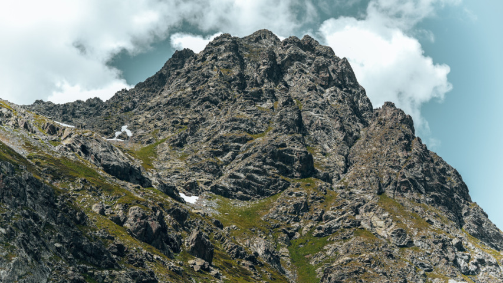

## mpv の特徴

[mpv](https://mpv.io/) はフリーのメディアプレーヤーで、次の特徴がある。

- 高品質なビデオ出力（OpenGL, Vulkan）
- ビデオのハードウェアデコード
- オンスクリーンコントローラー（マウスを動かすと表示される）
- 活発に[開発中](https://github.com/mpv-player/mpv/commits/master)

## 基本設定

### mpv.conf を設定

~/.config/mpv/mpv.conf を作成して次の行を追加。

```
# ビデオ出力ドライバー
# https://mpv.io/manual/stable/#video-output-drivers
vo=gpu-next

# グラフィックスAPI
# https://mpv.io/manual/stable/#options-gpu-api
gpu-api=auto

# ハードウェアビデオデコードを有効にする
# https://mpv.io/manual/stable/#options-hwdec
hwdec=auto

# ハードウェアデコードを行うコーデック
# 「vainfo | grep AV1」を実行して、何も表示されない場合は「av1,」を削除。
# https://mpv.io/manual/stable/#options-hwdec-codecs
hwdec-codecs=h264,vc1,hevc,vp8,vp9,prores,prores_raw,ffv1,dpx
```

```
# アップスケーラー
# https://mpv.io/manual/stable/#options-scale
scale=lanczos

# ダウンスケーラー
# https://mpv.io/manual/stable/#options-dscale
dscale=lanczos
```

```
# オーディオ出力ドライバー
# https://mpv.io/manual/stable/#audio-output-drivers-ao
ao=pipewire
```

```
# 音声のみのファイルでもウィンドウを表示
# https://mpv.io/manual/stable/#options-force-window
force-window=yes

# ウィンドウを最大化
# https://mpv.io/manual/stable/#options-window-maximized
window-maximized=yes

# ターミナル出力の冗長性を減らす
# https://mpv.io/manual/stable/#options-quiet
quiet=yes

# ウィンドウ右下の「残り時間」を「全体時間」に変更
# https://mpv.io/manual/stable/#on-screen-controller-timetotal
script-opts=osc-timetotal=yes

# ウィンドウのタイトルバーに動画タイトルではなくファイル名を表示
# https://mpv.io/manual/stable/#options-title
title=${filename}

# プレイリストに動画タイトルではなくファイル名を表示
# https://mpv.io/manual/stable/#options-osd-playlist-entry
osd-playlist-entry=filename
```

### input.conf を設定

~/.config/mpv/input.conf を作成して次の行を追加。デフォルトは[こちら](https://github.com/mpv-player/mpv/blob/master/etc/input.conf)。

```
# 右クリックで一時停止しない
MBTN_RIGHT ignore

# マウスホイールで音量を変更しない
WHEEL_UP ignore
WHEEL_DOWN ignore

# チルトホイールで10秒移動しない
WHEEL_LEFT ignore
WHEEL_RIGHT ignore

# PGUP と PGDWN で10分移動
PGUP seek 600
PGDWN seek -600
```

```
# マウスの進むボタンと戻るボタンで次/前のファイルに移動
MBTN_FORWARD playlist-next;show-text ${playlist} 2000
MBTN_BACK playlist-prev;show-text ${playlist} 2000

# . と , で次/前のファイルに移動
. playlist-next;show-text ${playlist} 2000
, playlist-prev;show-text ${playlist} 2000

# \ と / で次/前のチャプターに移動
\ add chapter 1
/ add chapter -1
```

```
# i でファイル情報の表示をトグル
# I でファイル情報を一時的に表示
i script-binding stats/display-stats-toggle
I script-binding stats/display-stats

# Ctrl+d で再生中のファイルをゴミ箱に移動
Ctrl+d run gio trash "${path}"; playlist-remove current; show-text "\"${filename}\" をゴミ箱に移動しました" 5000

# Esc で終了
ESC quit
```

### モニターに超解像技術が搭載されている場合

モニターに超解像技術が搭載されている場合はオフにする。アップスケーラーの効果がわかりづらくなるので。
REGZA を使用している場合は次のようにする。

- 低遅延モード: オン (オフだと黒背景時の赤文字が滲む)
- レゾリューションプラス: オフ
- ヒストグラムバックライト制御: オン
- 質感リアライザー: オート (オフだと全体が白っぽくなる)

## 外部のアップスケーラーをインストール

複数のバリアントがある場合は、内蔵GPUでもコマ落ちしないよう、負荷が軽いものを選んだ。

### RAVU

Google の超解像技術から着想を得たアップスケーラー。
[https://github.com/bjin/mpv-prescalers](https://github.com/bjin/mpv-prescalers)

```
wget https://raw.githubusercontent.com/bjin/mpv-prescalers/refs/heads/master/compute/ravu-lite-ar-r4.hook
wget https://raw.githubusercontent.com/bjin/mpv-prescalers/refs/heads/master/compute/ravu-lite-r3.hook
wget https://raw.githubusercontent.com/bjin/mpv-prescalers/refs/heads/master/compute/ravu-lite-r4.hook
wget https://raw.githubusercontent.com/bjin/mpv-prescalers/refs/heads/master/compute/ravu-r4.hook
wget https://raw.githubusercontent.com/bjin/mpv-prescalers/refs/heads/master/compute/ravu-zoom-ar-r3.hook
wget https://raw.githubusercontent.com/bjin/mpv-prescalers/refs/heads/master/compute/ravu-zoom-r3.hook
mkdir -p ~/.config/mpv/shaders
mv ravu-*.hook ~/.config/mpv/shaders/
```

[compute](https://github.com/bjin/mpv-prescalers/tree/master/compute) ディレクトリのものが高速。動作しない場合は [gather](https://github.com/bjin/mpv-prescalers/tree/master/gather) か[ルート](https://github.com/bjin/mpv-prescalers/tree/master)のものを使用する。

### Anime4K

1080pアニメのアップスケールに最適化されたアップスケーラー。
[https://github.com/bloc97/Anime4K](https://github.com/bloc97/Anime4K)

```
wget https://raw.githubusercontent.com/bloc97/Anime4K/refs/heads/master/glsl/Upscale/Anime4K_Upscale_CNN_x2_M.glsl
wget https://raw.githubusercontent.com/bloc97/Anime4K/refs/heads/master/glsl/Upscale/Anime4K_Upscale_CNN_x2_S.glsl
mkdir -p ~/.config/mpv/shaders
mv Anime4K_Upscale_CNN_x2_*.glsl ~/.config/mpv/shaders/

wget https://raw.githubusercontent.com/bloc97/Anime4K/refs/heads/master/glsl/Upscale/Anime4K_Upscale_CNN_x2_UL.glsl
mkdir -p ~/.config/mpv/shaders_high
mv Anime4K_Upscale_CNN_x2_*.glsl ~/.config/mpv/shaders_high/
```

### ACNetGLSL

Anime4KCPP プロジェクトで使用されている深層学習モデルを GLSL で実装したもの。
[https://github.com/TianZerL/ACNetGLSL](https://github.com/TianZerL/ACNetGLSL)

```
wget https://raw.githubusercontent.com/TianZerL/ACNetGLSL/refs/heads/master/glsl/acnet/acnet_f8b4.glsl
wget https://raw.githubusercontent.com/TianZerL/ACNetGLSL/refs/heads/master/glsl/acnet/acnet_f8b4_box.glsl
wget https://raw.githubusercontent.com/TianZerL/ACNetGLSL/refs/heads/master/glsl/acnet/acnet_f8b4_box_hdn.glsl
wget https://raw.githubusercontent.com/TianZerL/ACNetGLSL/refs/heads/master/glsl/acnet/acnet_f8b4_hdn.glsl
mkdir -p ~/.config/mpv/shaders
mv acnet_f8*.glsl ~/.config/mpv/shaders/

wget https://raw.githubusercontent.com/TianZerL/ACNetGLSL/refs/heads/master/glsl/acnet/acnet_f8b18.glsl
wget https://raw.githubusercontent.com/TianZerL/ACNetGLSL/refs/heads/master/glsl/acnet/acnet_f8b18_box.glsl
wget https://raw.githubusercontent.com/TianZerL/ACNetGLSL/refs/heads/master/glsl/acnet/acnet_f8b18_box_hdn.glsl
wget https://raw.githubusercontent.com/TianZerL/ACNetGLSL/refs/heads/master/glsl/acnet/acnet_f8b18_hdn.glsl
mkdir -p ~/.config/mpv/shaders_high
mv acnet_f8*.glsl ~/.config/mpv/shaders_high/
```

### FSRCNNX

FSRCNN（高速超解像畳み込みニューラルネットワーク）を使用したアップスケーラー。
[https://github.com/igv/FSRCNN-TensorFlow](https://github.com/igv/FSRCNN-TensorFlow)

```
wget https://github.com/igv/FSRCNN-TensorFlow/releases/download/1.1/FSRCNNX_x2_8-0-4-1.glsl
mkdir -p ~/.config/mpv/shaders
mv FSRCNNX_x2_*.glsl ~/.config/mpv/shaders/

wget https://github.com/igv/FSRCNN-TensorFlow/releases/download/1.1/FSRCNNX_x2_16-0-4-1.glsl
mkdir -p ~/.config/mpv/shaders_high
mv FSRCNNX_x2_*.glsl ~/.config/mpv/shaders_high/
```

### ArtCNN

アニメコンテンツを対象としたアップスケーラー。
[https://github.com/Artoriuz/ArtCNN](https://github.com/Artoriuz/ArtCNN)

```
wget https://raw.githubusercontent.com/Artoriuz/ArtCNN/refs/heads/main/GLSL/ArtCNN_C4F16.glsl
wget https://raw.githubusercontent.com/Artoriuz/ArtCNN/refs/heads/main/GLSL/ArtCNN_C4F16_DN.glsl
wget https://raw.githubusercontent.com/Artoriuz/ArtCNN/refs/heads/main/GLSL/ArtCNN_C4F16_DS.glsl
mkdir -p ~/.config/mpv/shaders
mv ArtCNN_C4F*.glsl ~/.config/mpv/shaders/

wget https://raw.githubusercontent.com/Artoriuz/ArtCNN/refs/heads/main/GLSL/ArtCNN_C4F32.glsl
wget https://raw.githubusercontent.com/Artoriuz/ArtCNN/refs/heads/main/GLSL/ArtCNN_C4F32_DN.glsl
wget https://raw.githubusercontent.com/Artoriuz/ArtCNN/refs/heads/main/GLSL/ArtCNN_C4F32_DS.glsl
mkdir -p ~/.config/mpv/shaders_high
mv ArtCNN_C4F*.glsl ~/.config/mpv/shaders_high/
```

## アップスケーラーの品質を測定

### 風景写真の場合



Source: "[Yedigöller dağları](https://www.pexels.com/photo/yedigoller-daglari-27684806/)" by Mehmet Karaca
License: [https://www.pexels.com/ja-JP/license/](https://www.pexels.com/ja-JP/license/)

模様が複雑で余白が少ない画像を使用すると、アップスケーラーの差異が出やすい。
縦長画像の場合は中央部分を画面いっぱいに表示する（`--panscan=1.0`）。

"[Yedigöller dağları](https://www.pexels.com/photo/yedigoller-daglari-27684806/)" をクリックして右上の「Free download」をクリック。
ダウンロードした画像を mpv でフルスクリーン表示。

```
image_orig="pexels-mehmetkaraca-27684806.jpg"
image_base="${image_orig%.*}"

mpv_options="--no-config --load-scripts=no --no-osc --scale=lanczos --screenshot-format=png --screenshot-dir=${PWD} -fs --pause"

mpv ${mpv_options} "${image_base}.jpg" --panscan=1.0 --glsl-shaders="" --screenshot-template="${image_base}_fullscreen"
```

画像が表示されたら「Ctrl+s」でスクリーンショットを撮り、「q」で終了する。
できた画像を「画像A」とする。

「画像A」を縦480にリサイズ。

```
image_orig="pexels-mehmetkaraca-27684806.jpg"
image_base="${image_orig%.*}"

magick ${image_base}_fullscreen.png -resize x480 -quality 92 "${image_base}_480.jpg"
```

できた画像を「画像B」とする。
「画像B」は JPEG 形式にする。PNG 形式だとアップスケーラーが効かない場合があった。

「画像B」を mpv でフルスクリーンにアップスケール。縦横それぞれ2倍以上にしないと、アップスケーラーによる差異が見えづらい。

```
image_orig="pexels-mehmetkaraca-27684806.jpg"
image_base="${image_orig%.*}"

mpv_options="--no-config --load-scripts=no --no-osc --scale=lanczos --screenshot-format=png --screenshot-dir=${PWD} -fs --pause"

for shader_file in ~/.config/mpv/shaders/*
do
  shader_base=$(basename "${shader_file}")
  shader_base=${shader_base%.*}
  mpv ${mpv_options} "${image_base}_480.jpg" --glsl-shaders="${shader_file}" --screenshot-template="${image_base}_480-${shader_base}"
done

mpv ${mpv_options} "${image_base}_480.jpg" --glsl-shaders="" --screenshot-template="${image_base}_480-lanczos"
```

画像が表示されたら「Ctrl+s」でスクリーンショットを撮り、「q」で終了する。
自動的に次の画像が表示されるので、同じことを繰り返す。
できた画像を「画像C」とする。

「画像A」と「画像C」の差異を測定する。

```
image_orig="pexels-mehmetkaraca-27684806.jpg"
image_base="${image_orig%.*}"

printf "File | Score\n"
printf "%s\n" "-- | --"

for image_file in ${image_base}_480-*.png
do
  score=$(magick compare -metric SSIM "${image_base}_fullscreen.png" "${image_file}" null: 2>&1)
  shader_name=${image_file#${image_base}_}
  shader_name=${shader_name#480-}
  shader_name=${shader_name%.*}
  printf "%s | %s\n" "${shader_name}" "${score}"
done | sort -t '|' -k 2 -g
```

### 結果 (低負荷バリアント)

スコアが小さいほどオリジナルに近い。
順位は使用する画像によって変わるので、絶対的なものではない。
100以下の差は目視だとほとんどわからない。

File | Score
-- | --
FSRCNNX_x2_8-0-4-1 | 5467.92 (0.083435)
acnet_f8b4 | 5478.52 (0.0835969)
ArtCNN_C4F16_DS | 5492.09 (0.0838039)
ravu-lite-r4 | 5624.97 (0.0858315)
ravu-lite-r3 | 5636.77 (0.0860116)
ArtCNN_C4F16 | 5663.09 (0.0864133)
acnet_f8b4_box | 5673.56 (0.0865729)
acnet_f8b4_hdn | 5690.65 (0.0868338)
ravu-zoom-r3 | 5788.55 (0.0883277)
Anime4K_Upscale_CNN_x2_M | 5851.66 (0.0892906)
ravu-lite-ar-r4 | 5853.24 (0.0893148)
acnet_f8b4_box_hdn | 5873.4 (0.0896223)
Anime4K_Upscale_CNN_x2_S | 5993.31 (0.091452)
ravu-zoom-ar-r3 | 6052.71 (0.0923585)
lanczos | 6262.4 (0.0955581)
ravu-r4 | 6374.43 (0.0972676)
ArtCNN_C4F16_DN | 6501.01 (0.0991991)

### 結果 (高負荷バリアント)

スコアが小さいほどオリジナルに近い。
順位は使用する画像によって変わるので、絶対的なものではない。
100以下の差は目視だとほとんどわからない。

File | Score
-- | --
acnet_f8b18 | 5402.44 (0.082436)
FSRCNNX_x2_16-0-4-1 | 5424.86 (0.0827781)
ArtCNN_C4F32_DS | 5433.53 (0.0829104)
acnet_f8b18_hdn | 5502.03 (0.0839557)
acnet_f8b18_box | 5581.1 (0.0851622)
ArtCNN_C4F32 | 5612.65 (0.0856436)
acnet_f8b18_box_hdn | 5749.02 (0.0877244)
Anime4K_Upscale_CNN_x2_UL | 5809.67 (0.0886499)
lanczos | 6262.4 (0.0955581)
ArtCNN_C4F32_DN | 6495.45 (0.0991142)

### アニメ画像の場合


Source: "[千と千尋の神隠し 作品静止画](https://www.ghibli.jp/works/chihiro/#frame)" by STUDIO GHIBLI
License: [画像は常識の範囲でご自由にお使いください。](https://www.ghibli.jp/works/chihiro/#frame)

風景写真のときと同じ方法で測定する。

### 結果 (低負荷バリアント)

スコアが小さいほどオリジナルに近い。
順位は使用する画像によって変わるので、絶対的なものではない。
100以下の差は目視だとほとんどわからない。

File | Score
-- | --
ArtCNN_C4F16_DS | 2377.32 (0.0362755)
acnet_f8b4_hdn | 2490.31 (0.0379996)
Anime4K_Upscale_CNN_x2_M | 2572.14 (0.0392484)
acnet_f8b4_box_hdn | 2616.02 (0.0399179)
Anime4K_Upscale_CNN_x2_S | 2745.35 (0.0418913)
acnet_f8b4 | 2812.43 (0.042915)
FSRCNNX_x2_8-0-4-1 | 2856.32 (0.0435847)
acnet_f8b4_box | 2902.71 (0.0442925)
ArtCNN_C4F16 | 2953.2 (0.045063)
ArtCNN_C4F16_DN | 2971.24 (0.0453383)
ravu-lite-ar-r4 | 3181.88 (0.0485524)
ravu-zoom-ar-r3 | 3196.44 (0.0487746)
ravu-zoom-r3 | 3204.45 (0.0488968)
ravu-lite-r3 | 3208.48 (0.0489582)
ravu-lite-r4 | 3213.34 (0.0490325)
ravu-r4 | 3359.2 (0.0512582)
lanczos | 3631.37 (0.0554111)

### 結果 (高負荷バリアント)

スコアが小さいほどオリジナルに近い。
順位は使用する画像によって変わるので、絶対的なものではない。
100以下の差は目視だとほとんどわからない。

File | Score
-- | --
ArtCNN_C4F32_DS | 2321.88 (0.0354297)
acnet_f8b18_hdn | 2424.86 (0.037001)
Anime4K_Upscale_CNN_x2_UL | 2464.49 (0.0376057)
acnet_f8b18_box_hdn | 2528.04 (0.0385754)
FSRCNNX_x2_16-0-4-1 | 2698.8 (0.041181)
acnet_f8b18 | 2837.28 (0.0432941)
acnet_f8b18_box | 2875.56 (0.0438783)
ArtCNN_C4F32 | 2914.45 (0.0444717)
ArtCNN_C4F32_DN | 2934.9 (0.0447837)
lanczos | 3631.37 (0.0554111)

### アップスケーラーによる差異を目視で確認

アップスケーラーにショートカットを割り当てる。
~/.config/mpv/input.conf に次の行を追加。

```
# アップスケーラーの切り替え
Ctrl+1 change-list glsl-shaders set "~~/shaders/ravu-lite-r4.hook"
Ctrl+2 change-list glsl-shaders set "~~/shaders/acnet_f8b4_hdn.glsl"
Ctrl+3 change-list glsl-shaders set "~~/shaders/acnet_f8b4_box_hdn.glsl"
Ctrl+4 change-list glsl-shaders set "~~/shaders/ArtCNN_C4F16_DS.glsl"
Ctrl+5 change-list glsl-shaders set "~~/shaders/Anime4K_Upscale_CNN_x2_S.glsl"
Ctrl+6 change-list glsl-shaders set "~~/shaders/Anime4K_Upscale_CNN_x2_M.glsl"
Ctrl+7 change-list glsl-shaders set "~~/shaders/FSRCNNX_x2_8-0-4-1.glsl"
Ctrl+0 change-list glsl-shaders set ""; set scale lanczos
```

風景写真を表示。

```
mpv https://raw.githubusercontent.com/utuhiro78/linuxplayers/refs/heads/main/images/mpv/pexels-mehmetkaraca-27684806_480.jpg --no-osc --fs --pause
```

Ctrl キーを押したまま「0101」「0202」「1212」のように入力して、アップスケーラーをパラパラ漫画のように切り替える。こうするとアップスケーラーによる差異が見えやすくなる。

アニメ画像を表示。

```
mpv https://raw.githubusercontent.com/utuhiro78/linuxplayers/refs/heads/main/images/mpv/chihiro030_480.jpg --no-osc --fs --pause
```

同様に入力して違いを確認。

### デフォルトのアップスケーラーを設定

「acnet_f8b4_box_hdn」をデフォルトにする場合は、~/.config/mpv/mpv.conf に次の行を追加。
内蔵アップスケーラーのみを使用する場合は何も書かない。

```
# 外部アップスケーラー
# https://mpv.io/manual/stable/#options-glsl-shaders
glsl-shader="~~/shaders/acnet_f8b4_box_hdn.glsl"
```

## アップスケーラーの速度を比較


Source: "[Aerial view of a boat sailing in the sea](https://www.pexels.com/video/aerial-view-of-a-boat-sailing-in-the-sea-28478483/)" by Burak Evlivan
License: [https://www.pexels.com/ja-JP/license/](https://www.pexels.com/ja-JP/license/)

縦480にリサイズした動画をノーウェイトで全画面再生して、終了までの時間を計測する。
[mpv_shader_benchmark.py](https://github.com/utuhiro78/linuxplayers/blob/main/images/mpv/mpv_shader_benchmark.py)

```
wget https://raw.githubusercontent.com/utuhiro78/linuxplayers/refs/heads/main/images/mpv/mpv_shader_benchmark.py

python mpv_shader_benchmark.py ~/.config/mpv/shaders/*
```

縦480へのリサイズは次のように行った。

```
for file in *.mp4
do
  ffmpeg -i "${file}" -vf scale=854:480:flags=lanczos "${file%.mp4}_480.mp4"
done
```

### 結果 (低負荷バリアント)

GPUによって速度は変わる。
動画の収録時間は25秒なので、25秒以上かかるものはコマ落ちする。

Upscaler | Time (sec)
-- | --
lanczos | 3.32
ravu-lite-r3 | 6.17
ravu-lite-r4 | 6.44
ravu-lite-ar-r4 | 6.67
Anime4K_Upscale_CNN_x2_S | 7.39
ravu-r4 | 8.38
ravu-zoom-r3 | 8.55
Anime4K_Upscale_CNN_x2_M | 9.28
ravu-zoom-ar-r3 | 10.65
acnet_f8b4_hdn | 11.4
acnet_f8b4 | 11.41
acnet_f8b4_box | 11.41
acnet_f8b4_box_hdn | 11.43
FSRCNNX_x2_8-0-4-1 | 12.62
ArtCNN_C4F16_DN | 17.07
ArtCNN_C4F16 | 17.09
ArtCNN_C4F16_DS | 17.09

使用したシステム:

 | 
-- | --
CPU | Ryzen 5 5600G
GPU | 内蔵GPU
解像度 | 1920x1080

## シングル曲のピーク音量を 0 dB に揃える（ノーマライズ）

6分以内のファイルであれば自動的にノーマライズする。元のファイルは一切変更しない。
[normalize-short-tracks.lua](https://github.com/utuhiro78/linuxplayers/blob/main/images/mpv/normalize-short-tracks.lua)

```
wget https://raw.githubusercontent.com/utuhiro78/linuxplayers/refs/heads/main/images/mpv/normalize-short-tracks.lua
mkdir -p ~/.config/mpv/scripts
mv normalize-short-tracks.lua ~/.config/mpv/scripts/
```

事前にファイルのピーク音量を検出し、そこが 0 dB になるよう [volume-gain](https://mpv.io/manual/stable/#options-volume-gain) を調整してから再生する。
ピーク音量の検出には時間がかかるので、実行するのは6分以内のファイルのみ。6分あればほとんどのシングル曲をカバーできる。
ノーマライズの結果は画面左上に表示される。

[HOME](index.html)
