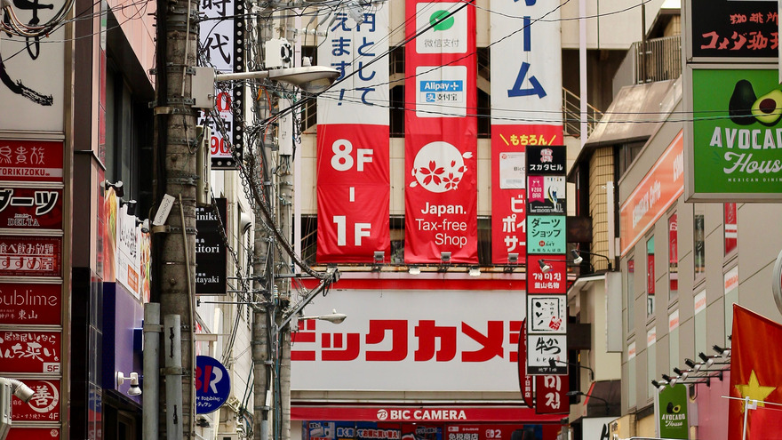
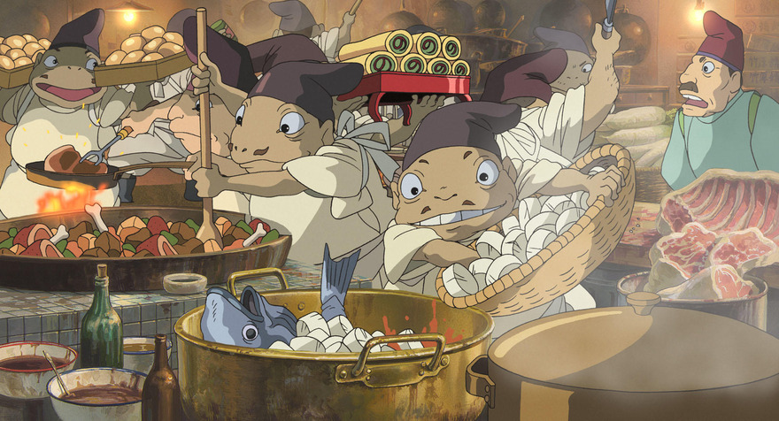
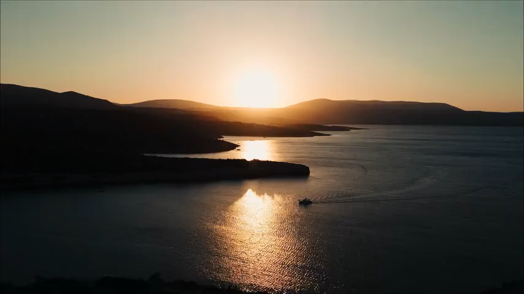

## mpv の特徴

[mpv](https://mpv.io/) はフリーのメディアプレーヤーで、次の特徴がある。

- 高品質なビデオ出力（OpenGL, Vulkan）
- ビデオのハードウェアデコード
- オンスクリーンコントローラー（マウスを動かすと表示される）
- 活発に[開発中](https://github.com/mpv-player/mpv/commits/master)

## 基本設定

### mpv.conf を設定

~/.config/mpv/mpv.conf を作成して次の行を追加。

```
# ビデオ出力ドライバー
# https://mpv.io/manual/stable/#video-output-drivers
vo=gpu-next

# グラフィックスAPI
# https://mpv.io/manual/stable/#options-gpu-api
gpu-api=auto

# ハードウェアビデオデコードを有効にする
# https://mpv.io/manual/stable/#options-hwdec
hwdec=auto

# ハードウェアデコードを行うコーデック
# 「vainfo | grep AV1」を実行して、何も表示されない場合は「av1,」を削除。
# https://mpv.io/manual/stable/#options-hwdec-codecs
hwdec-codecs=h264,vc1,hevc,vp8,vp9,prores,prores_raw,ffv1,dpx
```

```
# アップスケーラー
# https://mpv.io/manual/stable/#options-scale
scale=lanczos

# ダウンスケーラー
# https://mpv.io/manual/stable/#options-dscale
dscale=mitchell
```

```
# オーディオ出力ドライバー
# https://mpv.io/manual/stable/#audio-output-drivers-ao
ao=pipewire
```

```
# 音声のみのファイルでもウィンドウを表示
# https://mpv.io/manual/stable/#options-force-window
force-window=yes

# ウィンドウを最大化
# https://mpv.io/manual/stable/#options-window-maximized
window-maximized=yes

# ターミナル出力の冗長性を減らす
# https://mpv.io/manual/stable/#options-quiet
quiet=yes

# ウィンドウ右下の「残り時間」を「全体時間」に変更
# https://mpv.io/manual/stable/#on-screen-controller-timetotal
script-opts=osc-timetotal=yes

# ウィンドウのタイトルバーに動画タイトルではなくファイル名を表示
# https://mpv.io/manual/stable/#options-title
title=${filename}

# プレイリストに動画タイトルではなくファイル名を表示
# https://mpv.io/manual/stable/#options-osd-playlist-entry
osd-playlist-entry=filename
```

### input.conf を設定

~/.config/mpv/input.conf を作成して次の行を追加。デフォルトは[こちら](https://github.com/mpv-player/mpv/blob/master/etc/input.conf)。

```
# 右クリックで一時停止しない
MBTN_RIGHT ignore

# マウスホイールで音量を変更しない
WHEEL_UP ignore
WHEEL_DOWN ignore

# チルトホイールで10秒移動しない
WHEEL_LEFT ignore
WHEEL_RIGHT ignore

# PGUP と PGDWN で10分移動
PGUP seek 600
PGDWN seek -600
```

```
# マウスの進むボタンと戻るボタンで次/前のファイルに移動
MBTN_FORWARD playlist-next;show-text ${playlist} 2000
MBTN_BACK playlist-prev;show-text ${playlist} 2000

# . と , で次/前のファイルに移動
. playlist-next;show-text ${playlist} 2000
, playlist-prev;show-text ${playlist} 2000

# \ と / で次/前のチャプターに移動
\ add chapter 1
/ add chapter -1
```

```
# i でファイル情報の表示をトグル
# I でファイル情報を一時的に表示
i script-binding stats/display-stats-toggle
I script-binding stats/display-stats

# Ctrl+d で再生中のファイルをゴミ箱に移動
Ctrl+d run gio trash "${path}"; playlist-remove current; show-text "\"${filename}\" をゴミ箱に移動しました" 5000

# Esc で終了
ESC quit
```

### モニターに超解像技術が搭載されている場合

モニターに超解像技術が搭載されている場合はオフにする。アップスケーラーの効果がわかりづらくなるので。
REGZA を使用している場合は次のようにする。

- 低遅延モード: オン (オフだと黒背景時の赤文字が滲む)
- レゾリューションプラス: オフ
- ヒストグラムバックライト制御: オン
- 質感リアライザー: オート (オフだと全体が白っぽくなる)

## 外部のアップスケーラーをインストール

### 注意

FHD モニターで FHD 動画を表示すると、1 倍以下での表示になるので、これらのアップスケーラーは動作しない。動作しているアップスケーラーを確認するには、mpv で表示しているときに「i2」と入力する。

### RAVU

Google の超解像技術から着想を得たアップスケーラー。
[https://github.com/bjin/mpv-prescalers](https://github.com/bjin/mpv-prescalers)

```
wget https://raw.githubusercontent.com/bjin/mpv-prescalers/refs/heads/master/compute/ravu-lite-ar-r4.hook
wget https://raw.githubusercontent.com/bjin/mpv-prescalers/refs/heads/master/compute/ravu-lite-r4.hook
wget https://raw.githubusercontent.com/bjin/mpv-prescalers/refs/heads/master/compute/ravu-r4.hook
mkdir -p ~/.config/mpv/shaders
mv ravu-*.hook ~/.config/mpv/shaders/
```

[compute](https://github.com/bjin/mpv-prescalers/tree/master/compute) ディレクトリのものが高速。動作しない場合は [gather](https://github.com/bjin/mpv-prescalers/tree/master/gather) か[ルート](https://github.com/bjin/mpv-prescalers/tree/master)のものを使用する。

### Anime4K

1080pアニメの拡大に最適化されたアップスケーラー。
[https://github.com/bloc97/Anime4K](https://github.com/bloc97/Anime4K)

```
wget https://raw.githubusercontent.com/bloc97/Anime4K/refs/heads/master/glsl/Upscale/Anime4K_Upscale_CNN_x2_M.glsl
wget https://raw.githubusercontent.com/bloc97/Anime4K/refs/heads/master/glsl/Upscale/Anime4K_Upscale_CNN_x2_S.glsl
mkdir -p ~/.config/mpv/shaders
mv Anime4K_Upscale_CNN_x2_*.glsl ~/.config/mpv/shaders/

wget https://raw.githubusercontent.com/bloc97/Anime4K/refs/heads/master/glsl/Upscale/Anime4K_Upscale_CNN_x2_UL.glsl
mkdir -p ~/.config/mpv/shaders_high
mv Anime4K_Upscale_CNN_x2_*.glsl ~/.config/mpv/shaders_high/
```

通常は複数のシェーダーを[組み合わせて](https://github.com/bloc97/Anime4K/blob/master/md/Template/GLSL_Mac_Linux_Low-end/input.conf)使用するが、実写画像だと表示が崩れる場合があるので、Upscale_* を単体で使用する。

### ACNetGLSL

Anime4KCPP プロジェクトで使用されている深層学習モデルを、GLSL で実装したもの。
[https://github.com/TianZerL/ACNetGLSL](https://github.com/TianZerL/ACNetGLSL)

```
wget https://raw.githubusercontent.com/TianZerL/ACNetGLSL/refs/heads/master/glsl/acnet/acnet_f8b4.glsl
wget https://raw.githubusercontent.com/TianZerL/ACNetGLSL/refs/heads/master/glsl/acnet/acnet_f8b4_box.glsl
wget https://raw.githubusercontent.com/TianZerL/ACNetGLSL/refs/heads/master/glsl/acnet/acnet_f8b4_box_hdn.glsl
wget https://raw.githubusercontent.com/TianZerL/ACNetGLSL/refs/heads/master/glsl/acnet/acnet_f8b4_hdn.glsl
mkdir -p ~/.config/mpv/shaders
mv acnet_f8*.glsl ~/.config/mpv/shaders/

wget https://raw.githubusercontent.com/TianZerL/ACNetGLSL/refs/heads/master/glsl/acnet/acnet_f8b18.glsl
wget https://raw.githubusercontent.com/TianZerL/ACNetGLSL/refs/heads/master/glsl/acnet/acnet_f8b18_box.glsl
wget https://raw.githubusercontent.com/TianZerL/ACNetGLSL/refs/heads/master/glsl/acnet/acnet_f8b18_box_hdn.glsl
wget https://raw.githubusercontent.com/TianZerL/ACNetGLSL/refs/heads/master/glsl/acnet/acnet_f8b18_hdn.glsl
mkdir -p ~/.config/mpv/shaders_high
mv acnet_f8*.glsl ~/.config/mpv/shaders_high/
```

### FSRCNNX

FSRCNN（高速超解像畳み込みニューラルネットワーク）を使用したアップスケーラー。
[https://github.com/igv/FSRCNN-TensorFlow](https://github.com/igv/FSRCNN-TensorFlow)

```
wget https://github.com/igv/FSRCNN-TensorFlow/releases/download/1.1/FSRCNNX_x2_8-0-4-1.glsl
mkdir -p ~/.config/mpv/shaders
mv FSRCNNX_x2_*.glsl ~/.config/mpv/shaders/

wget https://github.com/igv/FSRCNN-TensorFlow/releases/download/1.1/FSRCNNX_x2_16-0-4-1.glsl
mkdir -p ~/.config/mpv/shaders_high
mv FSRCNNX_x2_*.glsl ~/.config/mpv/shaders_high/
```

### ArtCNN

アニメコンテンツを対象としたアップスケーラー。
[https://github.com/Artoriuz/ArtCNN](https://github.com/Artoriuz/ArtCNN)

```
wget https://raw.githubusercontent.com/Artoriuz/ArtCNN/refs/heads/main/GLSL/ArtCNN_C4F16.glsl
wget https://raw.githubusercontent.com/Artoriuz/ArtCNN/refs/heads/main/GLSL/ArtCNN_C4F16_DN.glsl
wget https://raw.githubusercontent.com/Artoriuz/ArtCNN/refs/heads/main/GLSL/ArtCNN_C4F16_DS.glsl
mkdir -p ~/.config/mpv/shaders
mv ArtCNN_C4F*.glsl ~/.config/mpv/shaders/

wget https://raw.githubusercontent.com/Artoriuz/ArtCNN/refs/heads/main/GLSL/ArtCNN_C4F32.glsl
wget https://raw.githubusercontent.com/Artoriuz/ArtCNN/refs/heads/main/GLSL/ArtCNN_C4F32_DN.glsl
wget https://raw.githubusercontent.com/Artoriuz/ArtCNN/refs/heads/main/GLSL/ArtCNN_C4F32_DS.glsl
mkdir -p ~/.config/mpv/shaders_high
mv ArtCNN_C4F*.glsl ~/.config/mpv/shaders_high/
```

## アップスケーラーの品質を測定

### 風景写真の場合



Source: "[Bustling Alleyway in Osaka](https://www.pexels.com/photo/bustling-alleyway-in-osaka-japan-s-shopping-district-38580804/)" by Catarina Duarte
License: [https://www.pexels.com/ja-JP/license/](https://www.pexels.com/ja-JP/license/)

街の風景写真でスコアを測定する。画像に文字が入っていると、鮮明さを目視で確認しやすい。
森林のような細かい画像は、どのアップスケーラーを使用してもオリジナルに近づきにくい。顔のアップのような変化が乏しい画像は、どのアップスケーラーを使用しても似たようなスコアになる。
余白が多いと変化する領域が少なくなるので、縦長画像の場合は中央部分を画面いっぱいに表示する（`--panscan=1.0`）。

"[Bustling Alleyway in Osaka](https://www.pexels.com/photo/bustling-alleyway-in-osaka-japan-s-shopping-district-38580804/)" をクリックして右上の「Free download」をクリック。
ダウンロードした画像を mpv で全画面サイズで表示。

```
cat << 'EOF' > make-reference-images.sh
#!/bin/sh

image_orig=${1}
image_base="${image_orig%.*}"

mpv_options="--no-config --load-scripts=no --no-osc --screenshot-dir=${PWD} --pause"

mpv ${mpv_options} --panscan=1.0 --fs --screenshot-format=png --screenshot-template="${image_base}_reference" "${image_base}.jpg"
EOF
```

```
sh make-reference-images.sh pexels-cateduart-38580804.jpg
```

画像が表示されたら「Ctrl+s」でスクリーンショットを撮り、「q」で終了する。
できた画像を「画像A」とする。

「画像A」を mpv で 480p に縮小して表示。

```
cat << 'EOF' > make-downscaled-images.sh
#!/bin/sh

image_orig=${1}
image_base="${image_orig%_reference.png}"

mpv_options="--no-config --load-scripts=no --no-osc --screenshot-dir=${PWD} --pause"

mpv ${mpv_options} --vf=scale=-2:480 --screenshot-format=jpg --screenshot-jpeg-quality=96 --screenshot-template="${image_base}_downscaled" "${image_orig}"
EOF
```

```
sh make-downscaled-images.sh pexels-cateduart-38580804_reference.png
```

画像が表示されたら「Ctrl+s」でスクリーンショットを撮り、「q」で終了する。
できた画像を「画像B」とする。
「画像B」は JPEG 形式にする。PNG 形式だと動作しないアップスケーラーがある。
動作しているアップスケーラーを確認するには、mpv で表示しているときに「i2」と入力する。

「画像B」を mpv で全画面サイズに拡大。

```
cat << 'EOF' > make-upscaled-images.sh
#!/bin/sh

image_orig=${1}
image_base="${image_orig%_downscaled.jpg}"

mpv_options="--no-config --load-scripts=no --no-osc --screenshot-dir=${PWD} --pause"

for shader_file in ${HOME}/.config/mpv/shaders/*
do
  shader_base=$(basename "${shader_file}")
  shader_base=${shader_base%.*}
  mpv ${mpv_options} --glsl-shaders="${shader_file}" --fs --screenshot-format=png --screenshot-template="${image_base}_upscaled-${shader_base}" "${image_orig}"
done

mpv ${mpv_options} --fs --screenshot-format=png --screenshot-template="${image_base}_upscaled-lanzcos" "${image_orig}"
EOF
```

```
sh make-upscaled-images.sh pexels-cateduart-38580804_downscaled.jpg ~/.config/mpv/shaders
```

画像が表示されたら「Ctrl+s」でスクリーンショットを撮り、メッセージが表示されたら「q」で終了する。
自動的に次の画像が表示されるので、同じことを繰り返す。
できた画像を「画像C」とする。「画像C」は PNG 形式にする。JPG 形式だとスコアが悪化する。

「画像A」と「画像C」の差を測定。

```
cat << 'EOF' > compare-upscaled-images.sh
#!/bin/sh

image_orig=${1}
image_base="${image_orig%_reference.png}"

printf "File | Score\n"
printf "%s\n" "-- | --"

for image_file in ${image_base}_upscaled-*.png
do
  score=$(magick compare -metric SSIM "${image_base}_reference.png" "${image_file}" null: 2>&1)
  shader_name=${image_file#${image_base}_}
  shader_name=${shader_name#upscaled-}
  shader_name=${shader_name%.*}
  printf "%s | %s\n" "${shader_name}" "${score}"
done | sort -t '|' -k 2 -g
EOF
```

```
sh compare-upscaled-images.sh pexels-cateduart-38580804_reference.png
```

続いて高負荷なアップスケーラーを測定。

```
mkdir -p gpu_low
mv pexels-cateduart-38580804_upscaled-*.png gpu_low/

mv ~/.config/mpv/shaders ~/.config/mpv/shaders_low
mv ~/.config/mpv/shaders_high ~/.config/mpv/shaders

sh make-upscaled-images.sh pexels-cateduart-38580804_downscaled.jpg

sh compare-upscaled-images.sh pexels-cateduart-38580804_reference.png

mkdir -p gpu_high
mv pexels-cateduart-38580804_upscaled-*.png gpu_high/

mv ~/.config/mpv/shaders ~/.config/mpv/shaders_high
mv ~/.config/mpv/shaders_low ~/.config/mpv/shaders
```

### 結果 (低負荷バリアント)

順位は「画像A」との相性や、「画像B」の作成方法、拡大率などによって大きく変わる。
スコアが小さいほどオリジナルに近い。
mpv のデフォルトは lanczos。それより 200 以上スコアが小さいものを選ぶと、効果がわかりやすい。
スコアの差が 100 以下だと、目視では効果がわかりにくい。

File | Score
-- | --
acnet_f8b4_hdn | 2455.02 (0.0374612)
acnet_f8b4 | 2516.32 (0.0383966)
FSRCNNX_x2_8-0-4-1 | 2516.7 (0.0384024)
Anime4K_Upscale_CNN_x2_M | 2526.74 (0.0385557)
acnet_f8b4_box_hdn | 2528.34 (0.03858)
ArtCNN_C4F16_DS | 2538.36 (0.0387329)
acnet_f8b4_box | 2590.16 (0.0395234)
ArtCNN_C4F16 | 2618.44 (0.0399548)
Anime4K_Upscale_CNN_x2_S | 2677.15 (0.0408507)
ArtCNN_C4F16_DN | 2774.97 (0.0423434)
ravu-lite-ar-r4 | 2913.33 (0.0444545)
ravu-lite-r4 | 3025.7 (0.0461693)
ravu-r4 | 3080.21 (0.0470011)
lanzcos | 3329.41 (0.0508035)

### 結果 (高負荷バリアント)

順位は「画像A」との相性や、「画像B」の作成方法、拡大率などによって大きく変わる。
スコアが小さいほどオリジナルに近い。
mpv のデフォルトは lanczos。それより 200 以上スコアが小さいものを選ぶと、効果がわかりやすい。
スコアの差が 100 以下だと、目視では効果がわかりにくい。

File | Score
-- | --
acnet_f8b18_hdn | 2351.31 (0.0358786)
FSRCNNX_x2_16-0-4-1 | 2394.58 (0.036539)
acnet_f8b18 | 2409.25 (0.0367628)
acnet_f8b18_box_hdn | 2430.97 (0.0370942)
Anime4K_Upscale_CNN_x2_UL | 2458.4 (0.0375127)
acnet_f8b18_box | 2493.66 (0.0380508)
ArtCNN_C4F32_DS | 2501.02 (0.0381631)
ArtCNN_C4F32 | 2535.77 (0.0386934)
ArtCNN_C4F32_DN | 2716.45 (0.0414503)
lanzcos | 3329.41 (0.0508035)

### アニメ画像の場合



Source: "[千と千尋の神隠し 作品静止画](https://www.ghibli.jp/works/chihiro/#frame)" by STUDIO GHIBLI
License: [画像は常識の範囲でご自由にお使いください。](https://www.ghibli.jp/works/chihiro/#frame)

30番目の画像を右クリックして、「名前を付けてリンク先を保存」を選択。
あとは風景写真のときと同じ方法で測定する。

```
sh make-reference-images.sh chihiro030.jpg

sh make-downscaled-images.sh chihiro030_reference.png

sh make-upscaled-images.sh chihiro030_downscaled.jpg

sh compare-upscaled-images.sh chihiro030_reference.png

mkdir -p gpu_low
mv chihiro030_upscaled-*.png gpu_low/
```

続いて高負荷なアップスケーラーを測定。

```
mv ~/.config/mpv/shaders ~/.config/mpv/shaders_low
mv ~/.config/mpv/shaders_high ~/.config/mpv/shaders

sh make-upscaled-images.sh chihiro030_downscaled.jpg

sh compare-upscaled-images.sh chihiro030_reference.png

mkdir -p gpu_high
mv chihiro030_upscaled-*.png gpu_high/

mv ~/.config/mpv/shaders ~/.config/mpv/shaders_high
mv ~/.config/mpv/shaders_low ~/.config/mpv/shaders
```

### 結果 (低負荷バリアント)

順位は「画像A」との相性や、「画像B」の作成方法、拡大率などによって大きく変わる。
スコアが小さいほどオリジナルに近い。
mpv のデフォルトは lanczos。それより 200 以上スコアが小さいものを選ぶと、効果がわかりやすい。
スコアの差が 100 以下だと、目視では効果がわかりにくい。

File | Score
-- | --
acnet_f8b4_hdn | 2705.98 (0.0412907)
acnet_f8b4_box_hdn | 2719.32 (0.0414942)
Anime4K_Upscale_CNN_x2_M | 2731.38 (0.0416781)
acnet_f8b4 | 2824.91 (0.0431053)
acnet_f8b4_box | 2835.6 (0.0432685)
Anime4K_Upscale_CNN_x2_S | 2841.98 (0.0433658)
ArtCNN_C4F16_DS | 2852.62 (0.0435282)
ArtCNN_C4F16 | 2895.01 (0.044175)
FSRCNNX_x2_8-0-4-1 | 2909.16 (0.044391)
ArtCNN_C4F16_DN | 2974.15 (0.0453826)
ravu-lite-ar-r4 | 3080.82 (0.0470102)
ravu-r4 | 3174.46 (0.0484391)
ravu-lite-r4 | 3208.89 (0.0489645)
lanzcos | 3470.92 (0.0529628)

### 結果 (高負荷バリアント)

順位は「画像A」との相性や、「画像B」の作成方法、拡大率などによって大きく変わる。
スコアが小さいほどオリジナルに近い。
mpv のデフォルトは lanczos。それより 200 以上スコアが小さいものを選ぶと、効果がわかりやすい。
スコアの差が 100 以下だと、目視では効果がわかりにくい。

File | Score
-- | --
acnet_f8b18_hdn | 2677.81 (0.0408607)
Anime4K_Upscale_CNN_x2_UL | 2687.13 (0.041003)
acnet_f8b18_box_hdn | 2688.79 (0.0410282)
acnet_f8b18 | 2760.47 (0.042122)
FSRCNNX_x2_16-0-4-1 | 2780.06 (0.0424211)
acnet_f8b18_box | 2800.66 (0.0427353)
ArtCNN_C4F32 | 2853.43 (0.0435405)
ArtCNN_C4F32_DS | 2869.11 (0.0437799)
ArtCNN_C4F32_DN | 2948.4 (0.0449897)
lanzcos | 3470.92 (0.0529628)

### アップスケーラーごとの差を目視で確認

アップスケーラーにショートカットを割り当てる。
~/.config/mpv/input.conf に次の行を追加。

```
# アップスケーラーの切り替え
Ctrl+1 change-list glsl-shaders set "~~/shaders/ravu-lite-ar-r4.hook"
Ctrl+2 change-list glsl-shaders set "~~/shaders/acnet_f8b4.glsl"
Ctrl+3 change-list glsl-shaders set "~~/shaders/acnet_f8b4_hdn.glsl"
Ctrl+4 change-list glsl-shaders set "~~/shaders/ArtCNN_C4F16.glsl"
Ctrl+5 change-list glsl-shaders set "~~/shaders/ArtCNN_C4F16_DS.glsl"
Ctrl+6 change-list glsl-shaders set "~~/shaders/Anime4K_Upscale_CNN_x2_S.glsl"
Ctrl+7 change-list glsl-shaders set "~~/shaders/Anime4K_Upscale_CNN_x2_M.glsl"
Ctrl+8 change-list glsl-shaders set "~~/shaders/FSRCNNX_x2_8-0-4-1.glsl"
Ctrl+0 change-list glsl-shaders set ""; set scale lanczos
```

風景写真を表示。

```
mpv --no-osc --fs --pause https://raw.githubusercontent.com/utuhiro78/linuxplayers/refs/heads/main/images/mpv/pexels-cateduart-38580804_downscaled.jpg
```

Ctrl キーを押したまま「0101」「0202」「1212」のように入力して、アップスケーラーをパラパラ漫画のように切り替える。こうするとアップスケーラーごとの差が見えやすくなる。

アニメ画像を表示。

```
mpv --no-osc --fs --pause https://raw.githubusercontent.com/utuhiro78/linuxplayers/refs/heads/main/images/mpv/chihiro030_downscaled.jpg
```

同様に入力して違いを確認。

### デフォルトのアップスケーラーを設定

「acnet_f8b4_hdn」をデフォルトにする場合は、~/.config/mpv/mpv.conf に次の行を追加。
内蔵アップスケーラーのみを使用する場合は何も書かない。

```
# 外部アップスケーラー
# https://mpv.io/manual/stable/#options-glsl-shaders
glsl-shader="~~/shaders/acnet_f8b4_hdn.glsl"
```

## アップスケーラーの速度を比較



Source: "[Aerial view of a boat sailing in the sea](https://www.pexels.com/video/aerial-view-of-a-boat-sailing-in-the-sea-28478483/)" by Burak Evlivan
License: [https://www.pexels.com/ja-JP/license/](https://www.pexels.com/ja-JP/license/)

"[Aerial view of a boat sailing in the sea](https://www.pexels.com/video/aerial-view-of-a-boat-sailing-in-the-sea-28478483/)" をクリックして右上の「Free download」をクリック。
ダウンロードした動画を 480p に縮小。

```
cat << 'EOF' > make-downscaled-movies.sh
#!/bin/sh

movie_file="${1}"
movie_base="${movie_file%.*}"

ffmpeg -i "${movie_file}" -vf "scale=-2:480:flags=lanczos" -c:v libx264 -crf 23 -c:a copy "${movie_base}_downscaled.mp4"
EOF
```

```
sh make-downscaled-movies.sh 12393381_3840_2160_60fps.mp4
```

できた動画をノーウェイトで全画面再生して、終了までの時間を計測する。
[mpv_shader_benchmark.py](https://github.com/utuhiro78/linuxplayers/blob/main/images/mpv/mpv_shader_benchmark.py)

```
wget https://raw.githubusercontent.com/utuhiro78/linuxplayers/refs/heads/main/images/mpv/mpv_shader_benchmark.py
wget https://raw.githubusercontent.com/utuhiro78/linuxplayers/refs/heads/main/images/mpv/12393381_3840_2160_60fps_downscaled.mp4

python mpv_shader_benchmark.py 12393381_3840_2160_60fps_downscaled.mp4 ~/.config/mpv/shaders/*
```

### 結果 (低負荷バリアント)

GPUによって速度は変わる。
動画の収録時間は25秒なので、25秒以上かかるものはコマ落ちする。

Upscaler | Time (sec)
-- | --
lanczos | 3.56
ravu-lite-r4 | 6.69
ravu-lite-ar-r4 | 6.79
Anime4K_Upscale_CNN_x2_S | 7.65
ravu-r4 | 8.5
Anime4K_Upscale_CNN_x2_M | 9.49
acnet_f8b4_box | 11.61
acnet_f8b4_box_hdn | 11.61
acnet_f8b4_hdn | 11.63
acnet_f8b4 | 11.64
FSRCNNX_x2_8-0-4-1 | 12.79
ArtCNN_C4F16_DS | 17.38
ArtCNN_C4F16 | 17.4
ArtCNN_C4F16_DN | 17.42

使用したシステム:

 | 
-- | --
CPU | Ryzen 5 5600G
GPU | 内蔵GPU
解像度 | 1920x1080

## シングル曲のピーク音量を 0 dB に揃える（ノーマライズ）

6分以内のファイルであれば自動的にノーマライズする。元のファイルは一切変更しない。
[normalize-short-tracks.lua](https://github.com/utuhiro78/linuxplayers/blob/main/images/mpv/normalize-short-tracks.lua)

```
wget https://raw.githubusercontent.com/utuhiro78/linuxplayers/refs/heads/main/images/mpv/normalize-short-tracks.lua
mkdir -p ~/.config/mpv/scripts
mv normalize-short-tracks.lua ~/.config/mpv/scripts/
```

事前にファイルのピーク音量を検出し、そこが 0 dB になるよう [volume-gain](https://mpv.io/manual/stable/#options-volume-gain) を調整してから再生する。
ピーク音量の検出には時間がかかるので、実行するのは6分以内のファイルのみ。6分あればほとんどのシングル曲をカバーできる。
ノーマライズの結果は画面左上に表示される。

[HOME](index.html)
